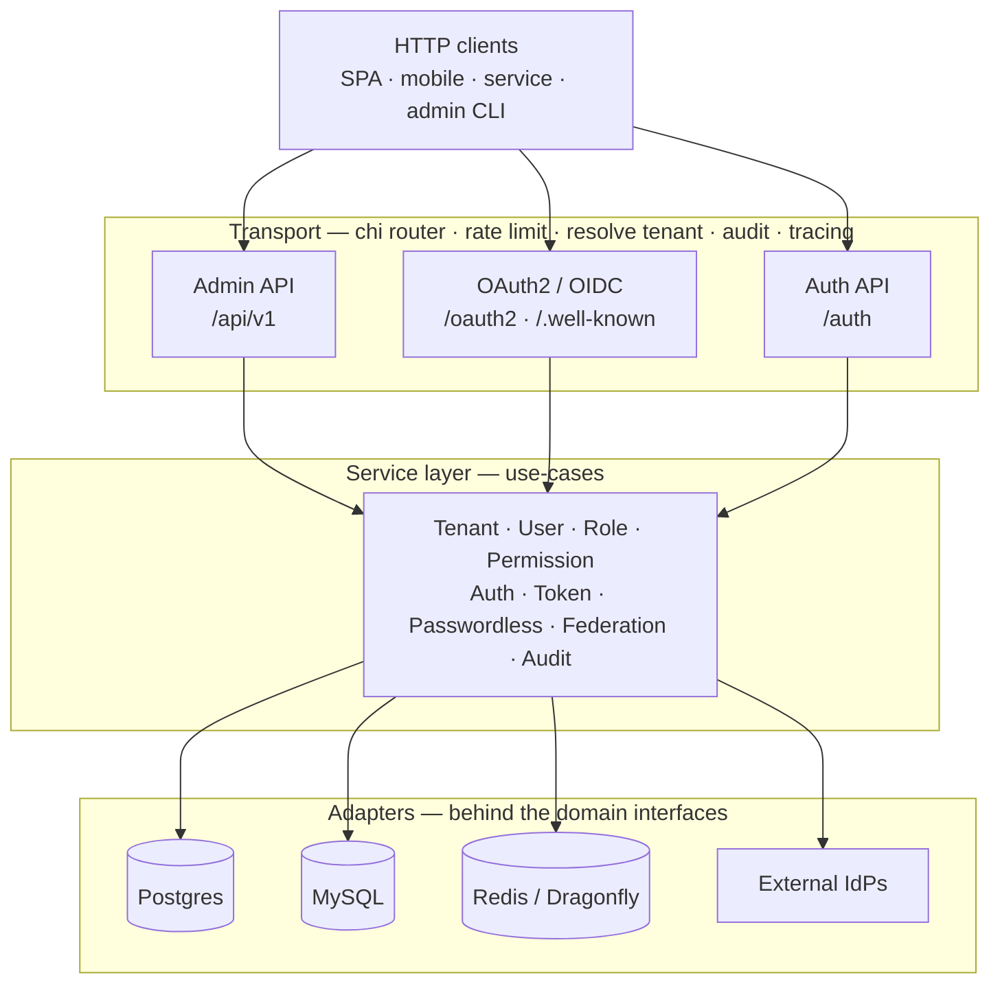
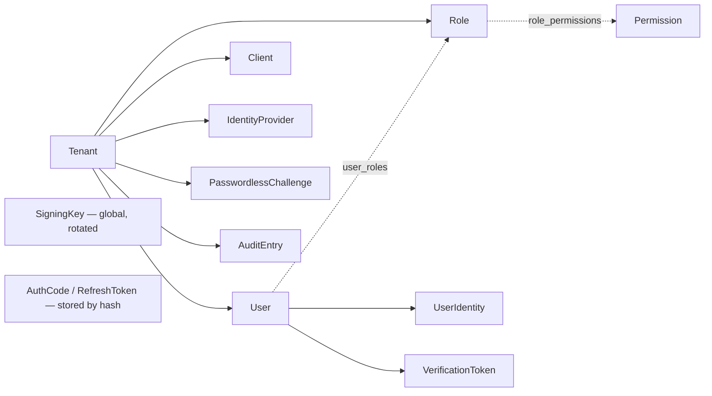

# Build a Multi-Tenant OAuth2 Provider: The Architecture

_By **ndmt1at21**, backend engineer. Published July 11, 2026. Part 1 of the series **"Designing a Multi-Tenant IAM Service in Go."**_

According to the Verizon 2025 DBIR, 88% of attacks against basic web applications involved stolen credentials, and 60% of breaches involved the human element ([Verizon, "2025 Data Breach Investigations Report"](https://www.verizon.com/business/resources/reports/dbir/)). In the same window, OWASP moved Broken Access Control to the number-one spot in its 2021 Top 10, present in 94% of tested applications ([OWASP Top 10:2021, A01](https://owasp.org/Top10/2021/A01_2021-Broken_Access_Control/)). In short: the place a system breaks most often is *who gets in* and *what they can do*. That's exactly the job an IAM service takes on.

This series is my design notes from building a multi-tenant IAM service in Go: an OAuth2 authorization server that is also an OpenID Connect provider, with built-in RBAC, federated login, passwordless, and a policy-decision-point role for an API gateway. Part 1 doesn't touch detailed code. It draws the whole-system map and, more importantly, says *why* each piece exists, so the later parts read light. [INTERNAL-LINK: choosing a database for a multi-tenant system → storage-selection post]

> **Key takeaways**
>
> - This IAM packs OAuth2 + OIDC + RBAC + federation + passwordless + PDP into one stateless Go service, running multi-tenant on a shared database.
> - 88% of basic web-app attacks involved stolen credentials (Verizon DBIR 2025); Broken Access Control is #1 in OWASP Top 10 2021. Auth and authz are where the investment pays off.
> - Hexagonal architecture: the domain and its repository interfaces stand alone, and everything SQL/cache/HTTP is just an adapter plugged in behind them. Swapping Postgres for MySQL never touches business logic.
> - Multi-tenancy by one `tenant_id` column on every tenant-owned row, with a separate OIDC issuer per tenant.
> - "Build vs. buy" has no universal answer: this post says plainly when to build and when to buy.

## Why is IAM the highest-leverage thing to invest in?

Because every request in the system has to answer two questions before it does anything: *who are you* and *what are you allowed to do*. The first is authentication, the second is authorization. IAM is the piece that answers both. It's the front door of the whole system, and if the front door is wrong, every security layer behind it is nearly meaningless.

The numbers up top say it plainly: stolen credentials are the most common way in, and broken access control is the #1 web risk. Both are failures at the IAM layer, not at the firewall or the network. Attackers usually don't break the wall; they walk straight through the door with a key they stole, or through the right door into a room they were never supposed to open.

[CALLOUT] IAM in one line: the right person, the right rights, at the right time. "Right person" is authentication, "right rights" is authorization, "right time" is tokens that expire and can be revoked. The whole series is about getting those three solid.

That's why IAM is worth more investment than almost any other component: get it right once and every service behind it is shielded; get it wrong once and the whole system is exposed at the same time. It's shared infrastructure, not a feature of any one app. Once that role is clear, the rest of the post starts drawing the concrete shape.

> IAM answers the two questions every request must ask: who are you (authentication) and what can you do (authorization). It's the system's front door, where most web attacks walk in with stolen credentials and where Broken Access Control ranks #1 at OWASP. Get it right once and everything behind it is shielded; wrong once and it's all exposed.

## What does this IAM actually do?

It's six things in one process. It's an OAuth2 authorization server (issues access and refresh tokens). It's an OpenID Connect provider (issues id_tokens, with discovery and JWKS). It has RBAC plus per-tenant dynamic permissions. It has federated login through Google, Facebook, and generic OIDC. It has passwordless via OTP and magic link. And it acts as a policy decision point so an API gateway can ask "should this request pass?"

Folding them into one service is deliberate, not lazy. Every path to a logged-in user, whether password, social, or OTP, ultimately funnels into the *same* token-issuing flow. So there's one place that signs tokens, one place that attaches permissions, one place that writes the audit log. Adding a new way to log in never spawns a new "token path."

[IMAGE: A block diagram of a single entrance where several login methods all lead to one token-issuing point. | stock: none | gen: Several small doors (password, social, OTP) on the left, all funneling through one central gateway that emits a single glowing key on the right, isometric flat vector illustration, dark navy background, cyan and orange accents, clean geometric lines, no gradients, 3:2, no text, no words, no logos]

## Why build my own instead of using Keycloak or Auth0?

For most teams, the honest answer is *don't*. Keycloak, Auth0, or Cognito cover most of the need and cost far less than self-maintaining a security-critical system. If your team has no truly special requirement, buy it and spend the time on what makes money.

I built my own for three specific needs that the ready-made options charge a premium for or won't let you bend: tenant isolation down to the database layer, a separate OIDC issuer per tenant, and letting tenants define their own permissions at runtime. I'm just naming them here, since each gets its own part to dig into; don't worry if they sound abstract for now.

[CHART] A "build vs. buy" decision table: the left column lists needs (real multi-tenancy, per-tenant issuer, runtime-custom permissions, on-prem data control, cost at scale) and the right marks managed IAM ✔/✘ against self-hosted ✔/✘.

> Building your own IAM service is only worth it when you need something the ready-made products charge a premium for or won't let you customize: tenant isolation at the data layer, a per-tenant OIDC issuer, and permissions the tenant defines at runtime. Missing any one of the three, buying is almost always cheaper than self-maintaining.

`[UNIQUE INSIGHT]` The part people skip: the real cost of "build your own" isn't the day you finish coding. It's rotating signing keys, patching disclosures, and being on call when tokens go out wrong. This whole series is written around those costs, not around the happy path.

## How do the three API groups split the work?

The HTTP surface is cut into three groups by *caller*, not by entity. The **Admin** group (`/api/v1/...`) is for administration: create tenants, users, roles, clients, permissions. The **OAuth2/OIDC** group (`/oauth2/...` and `/.well-known/...`) is the standard set: authorize, token, userinfo, introspect, revoke, discovery, JWKS. The **Auth** group (`/auth/...`) handles end-user flows: register, verify email, forgot/reset password, passwordless, and federation.

This split keeps each endpoint aware of exactly its own job. An admin request runs through admin authorization middleware; an `/oauth2/token` request runs through rate limiting and grant dispatch; a federation callback runs through state verification. All of it sits behind one chi router with cross-cutting middleware: resolve tenant, rate limit, audit, and tracing.

The diagram below is the map I want you to keep for the whole series: clients enter the transport layer, transport calls services, services only talk to interfaces, and Postgres/MySQL/cache/IdPs are just adapters plugged in behind.

> The IAM surface splits three ways: an Admin API to manage tenant resources, an OAuth2/OIDC API for the standard endpoints that issue and check tokens, and an Auth API for end-user flows like register, passwordless, and federation. All three call one service layer, and that layer talks only to interfaces, never to a concrete database.

## What's in the domain model?

Don't try to memorize the diagram below; you only need the general shape, and tenancy gets a whole Part 2 of its own. At the center sits `Tenant`, and almost everything else hangs beneath it. A tenant has many `User`, `Role`, `Client` (OAuth2 registration), `IdentityProvider` (per-tenant IdP config), `PasswordlessChallenge`, and `AuditEntry`. Each user can have many `UserIdentity` (federated account links) and `VerificationToken`. Roles connect to `Permission` through `role_permissions`, and users connect to roles through `user_roles`.

The most important invariant, and I'll repeat it in Part 2: every tenant-owned row carries a `tenant_id` column, and every repository method that reads or writes tenant data takes `tenantID` as its first argument. Because of that, cross-tenant leakage is nearly impossible at the repository layer, since no query can "forget" the tenant condition.

One small but sharp detail: `Permission` has a pointer `TenantID`. `TenantID == nil` means a system permission, seeded from code. `TenantID != nil` means a permission a tenant created at runtime. One table, two lifecycles, told apart only by whether that column is null. Part 5 dissects this.

## Why hexagonal, and why two backends at once?

Because I wanted to swap infrastructure without touching business logic. In a hexagonal architecture, `internal/domain` holds entities and repository interfaces with no external dependencies. All the SQL, cache, and HTTP are adapters behind those interfaces. The direct consequence: Postgres and MySQL are both first-class, chosen by config at startup through a storage factory, and the service layer never knows which one it's running on.

The approach I rejected is putting SQL straight into services. It's quick at first, but every driver swap or test then needs a real database standing up. With hexagonal, testing a service needs only a fake repository. The price is more interfaces and a little adapter boilerplate, but in return you get a clean line between "logic" and "where the wires plug in."

`[ORIGINAL DATA]` Concretely in the repo: `internal/` holds 13 packages (domain, service, repository, storage, transport, auth, rbac, tenant, authctx, observability, platform, config, mocks), about a dozen domain entities, and 7 grant types split into 7 separate files. Small numbers, but clean boundaries.

> Hexagonal here isn't about "doing it by the book." It's the tool that keeps two SQL backends both working, lets service tests skip the database, and keeps the logic layer from ever depending on a specific driver. That's an engineering reason, not an architectural preference.

## How is the service stateless and horizontally scalable?

By keeping no tenant state in process memory. All state lives in the database or a distributed cache: signing keys in their own table, federation and passwordless flow state in the cache with a TTL, rate-limit counters in the cache too. So you can run any number of instances behind a load balancer, and a request can land on any pod without a sticky session.

[CALLOUT] The one-line rule for the whole service: the process remembers nothing. Want to know if a token is still valid? Ask the database. Want to know if a federation state is legit? Ask the cache. There's no tenant map or session living in RAM to lose when a pod restarts.

The tradeoff is that most operations cost a round-trip to the database or cache. But it's worth paying: an auth system that can't scale horizontally becomes the bottleneck for every other service sitting behind it.

## What will the series cover?

Part 1 is the map. The six parts that follow each go into one region, each opening with "why do we need it?" before "how," and each carrying at least one diagram you can trace.

1. `[INTERNAL-LINK: Part 2 - Multi-tenancy by one tenant_id column → multi-tenant-by-column-tenant-id]` how tenants are isolated and the three-stage tenant resolution.
2. `[INTERNAL-LINK: Part 3 - The grant registry → oauth2-grant-registry-design]` turning `/token` into a dispatcher so you add login methods without editing the endpoint.
3. `[INTERNAL-LINK: Part 4 - Refresh token rotation → refresh-token-rotation-reuse-detection]` the token lifecycle, reuse detection, and rotating signing keys without dropping tokens.
4. `[INTERNAL-LINK: Part 5 - RBAC with dynamic permissions → rbac-dynamic-tenant-permissions]` the permission model and letting tenants define permissions at runtime.
5. `[INTERNAL-LINK: Part 6 - Federation and passwordless → federated-login-passwordless-one-flow]` many auth methods converging on one code flow.
6. `[INTERNAL-LINK: Part 7 - IAM as a Policy Decision Point → iam-policy-decision-point-gateway]` pushing authorization out to the API gateway.
7. `[INTERNAL-LINK: Part 8 - Secrets at rest, rate limits, observability → iam-security-hardening-observability]` the production things nobody teaches.

## FAQ

**Can Keycloak do multi-tenancy?**
Yes, through realms, and for many teams that's plenty. But realms lean toward isolation by configuration rather than isolation down to each row of data, and bending the permission model to your product gets awkward. If you need permissions a tenant defines at runtime, that's when building your own is worth weighing.

**Do I need OIDC for internal-only login?**
If a single app issues and checks its own tokens, plain OAuth2 is enough. You want OIDC when several apps trust one identity: id_token, discovery, and JWKS let each app verify a token independently without calling back to the server, exactly what makes credential-theft-driven attacks (88% of web-app attacks) harder to pull off.

**Postgres or MySQL?**
Both work, because the repository layer sits behind interfaces. Postgres is nicer for `jsonb` `metadata` and some partial-unique constraints; MySQL wins when your team already operates it well. Choose by your team, not by hype, knowing a later switch won't touch business logic.

**How long does adding a new grant take?**
Structurally, it's one file: implement the `Grant` interface, then register it in the registry at startup. Part 3 shows how this very split lets the 7 existing grants be tested in isolation, and why a dispatcher beats one giant `switch`.

## Up next

You now have the map: six capabilities in one stateless, multi-tenant Go service, built on a hexagonal core. From Part 2, I go into the most foundational and most error-prone piece: how one shared database serves many tenants without ever leaking across them, and why I return `ErrNotFound` rather than `ErrForbidden` when someone probes another tenant's ID.

`[INTERNAL-LINK: Read Part 2 - Multi-tenancy by one tenant_id column → multi-tenant-by-column-tenant-id]`

_References: [RFC 6749 - The OAuth 2.0 Authorization Framework](https://www.rfc-editor.org/rfc/rfc6749), [OpenID Connect Core 1.0](https://openid.net/specs/openid-connect-core-1_0.html), [OWASP Top 10:2021 - A01 Broken Access Control](https://owasp.org/Top10/2021/A01_2021-Broken_Access_Control/), [Verizon 2025 Data Breach Investigations Report](https://www.verizon.com/business/resources/reports/dbir/)._
