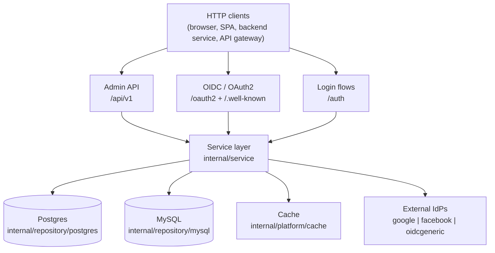

# Build a Multi-Tenant OAuth2 Provider: The Architecture

_By **ndmt1at21**, backend engineer. Published July 11, 2026. Part 1 of the series **"Designing a Multi-Tenant IAM Service in Go"**._

In the 2026 DBIR (published May 2026), Verizon analyzed 22,000+ confirmed breaches across 145 countries and logged a milestone: for the first time in the report's 19-year history, stolen credentials lost the #1 entry-point spot, ceding it to vulnerability exploitation at 31% ([Verizon, "2026 Data Breach Investigations Report"](https://www.verizon.com/about/news/breach-industry-wide-dbir-finds)). Good news for people who build IAM? Not quite. The same report finds credential abuse still present in 39% of all breaches when you measure the entire attack chain (per Push Security's review, "What the Verizon DBIR tells us about breaches in 2026"). Entry points change; the thing attackers carry through the whole campaign is still identity.

This series is my design notes from building a multi-tenant IAM service in Go: an OAuth2 authorization server that doubles as an OpenID Connect provider, with RBAC, federated login, passwordless, and a policy decision point (PDP) role for the API gateway. Part 1 stays away from line-by-line code. It draws the whole-system map and answers the question that matters most: why each piece exists. [INTERNAL-LINK: how to choose a database for a multi-tenant system → storage-selection post for SaaS]

> **Key takeaways**
>
> - Credential abuse shows up in 39% of all breaches in Verizon's 2026 DBIR; IAM remains the front door most worth reinforcing.
> - One stateless Go service packs OAuth2 + OIDC + RBAC + federation + passwordless + PDP, running multi-tenant on a shared database.
> - Hexagonal core: the domain knows nothing about SQL; Postgres and MySQL are two adapters behind one set of interfaces.
> - Build vs buy has no universal answer: this post ships a decision table and 3-year cost figures so you can weigh it yourself.

## Why is IAM the best place to invest first?

Because identity runs through nearly every attack: credential abuse appears in 39% of all breaches in the 2026 DBIR (Verizon, summarized by SpyCloud, "Top Takeaways from the 2026 Verizon DBIR"). Every request has to answer two questions before doing anything at all: who are you, and what are you allowed to do. IAM is the piece that answers both.

The interesting part of the 2026 DBIR is that at first glance it argues the opposite. Vulnerability exploitation now opens 31% of breaches, and credentials fell off the #1 entry spot for the first time in 19 years. SpyCloud's read of the data is blunt, though: the way in may be an exploit, but stolen credentials are how attackers move laterally, escalate privileges, and monetize their access. The exploit opens the door; identity carries them the rest of the way.

Cost data points in the same direction. IBM's "Cost of a Data Breach Report 2025" puts breaches that start with compromised credentials at $4.67M on average and 246 days to identify and contain, the slowest of any vector. That's eight months of someone logging in "legitimately" with a stolen key. What firewall catches that?

The authorization half looks no better. [OWASP Top 10:2025](https://owasp.org/Top10/2025/A01_2025-Broken_Access_Control/) keeps Broken Access Control at #1: 100% of tested applications carried some form of access-control failure, with 1,839,701 occurrences in the contributed data, the highest of any category. That's precisely the RBAC and PDP problem this series works through in Parts 5 and 7.

[CHART: Horizontal lollipop "Credentials in the 2026 DBIR, one number per stage": credential abuse appears in 39% of all breaches · 31% of breaches open with vulnerability exploitation · ~16% open with credential abuse · 50% of ransomware victims had a credential/infostealer event within the prior 95 days | Source: Verizon DBIR 2026 (Verizon newsroom; Push Security; SpyCloud)]

> In Verizon's 2026 DBIR (May 2026), credential abuse appears in 39% of all breaches even though only about 16% of breaches use it as the initial entry point. IBM's Cost of a Data Breach 2025 measures credential-origin breaches at $4.67M on average and 246 days to identify and contain, the slowest of any attack vector.

## What does this IAM actually do?

Six jobs in one Go process: OAuth2 authorization server, OIDC provider, RBAC, federated login, passwordless, and policy decision point. That's not a marketing slide: the repo's router mounts 16 public endpoints across the `/oauth2` and `/auth` groups alone (`router.go`, read 2026-07-12), before counting the Admin API.

```text
/.well-known/openid-configuration     /.well-known/jwks.json
GET  /oauth2/authorize                POST /oauth2/token
/oauth2/userinfo                      /oauth2/introspect
/oauth2/revoke                        /oauth2/logout
POST /authz/decision
/auth/passwordless/start
/auth/login/{provider}                /auth/callback/{provider}
/auth/register                        /auth/verify-email
/auth/forgot-password                 /auth/reset-password
```

The top half is pure standards: `authorize` and `token` per [RFC 6749](https://datatracker.ietf.org/doc/html/rfc6749), plus the id_token, discovery, and userinfo behavior defined by [OpenID Connect Core 1.0](https://openid.net/specs/openid-connect-core-1_0.html). One route stands out of line: `POST /authz/decision`, the PDP the API gateway calls on every request. The bottom half is the human side: registration, email verification, password resets, OTP, social login.

Why cram all of it into one place? Because every login path, whether password, social, or OTP, ends at exactly one token-issuing flow. One place signs tokens, one place attaches permissions, one place writes audit entries. Adding a new login method never spawns a second token path.

[IMAGE: A stylized building with three separate entrances that all lead into one shared hall, illustrating three API surfaces of a single service. | stock: none | gen: An isometric building cut open to show one shared interior, with three separate doorways on different faces, one door with a gear icon, one with a shield icon, one with a person icon, paths from each door merging into a single core room, isometric flat vector illustration, dark navy background, cyan and orange accents, clean geometric lines, no gradients, 16:9, no text, no words, no logos]

> This service exposes 16 public endpoints across its `/oauth2` and `/auth` route groups (`router.go`, read 2026-07-12), covering the full OAuth2 and OIDC surface: authorize, token, userinfo, introspect, revoke, logout, discovery, and JWKS, plus passwordless and federation flows that all drain into a single token-issuing path.

## Why build one instead of using Keycloak or Auth0?

The honest answer for most teams: don't. In a May 2026 analysis, [Duende Software](https://duendesoftware.com/blog/20260507-the-real-cost-of-build-vs-buy), "The Real Cost of Build vs. Buy for Identity", models a self-built identity stack at roughly $1.1M over 3 years, against about $210K with a bought framework. I built anyway, because of three specific needs that buying couldn't solve.

Read that number correctly first. Duende sells IdentityServer, so this is a vendor's model with an interest behind it, not neutral market research. To their credit, the assumptions are public: a $180K fully loaded engineer, a 3-person team building for 6 months, 0.5-1 FTE of ongoing maintenance, and $50K-200K per year for SOC 2. Cut the model in half if you like; building is still a real investment, not a side project.

Open source has been getting stronger too. The official release notes for [Keycloak 26](https://www.keycloak.org/2024/10/keycloak-2600-released) (October 2024) state: "Starting with Keycloak 26, the Organizations feature is fully supported", meaning first-class multi-tenancy inside a single realm. So what's missing? Three things, for me: organizations still share one realm and one issuer; runtime tenant-defined permissions aren't part of its model; and I wanted IAM embedded in existing Go infrastructure with dual Postgres/MySQL, not another JVM cluster to operate.

<!-- [UNIQUE INSIGHT] -->
The table below is my own analysis, assembled from Keycloak's release notes, Duende's cost model, and the repo itself:

| Need | Keycloak (Organizations, v26+) | Auth0 / managed | Build |
|---|---|---|---|
| One OIDC issuer + JWKS per tenant | No: organizations share a realm and an issuer | Partial: per-tenant orgs, but vendor-hosted, not yours | Yes: per-tenant issuers are native to the design |
| Tenant-defined permissions at runtime, inside tokens | Limited: static realm/client roles | Limited: built-in RBAC, custom claims via actions | Yes: permissions are data (Part 5) |
| Embed in existing infra (Go, dual Postgres/MySQL, no extra JVM) | No: brings its own JVM footprint | No: runs outside your infra, priced per MAU | Yes: one Go binary, storage of your choice |
| The price you pay | Operating a Keycloak cluster | Per-MAU pricing + vendor dependency | You own the security bar + 0.5-1 FTE upkeep (Duende's model) |

[CHART: Grouped bar "3-year cost: build vs buy a framework (Duende's vendor model, assumptions in caption)": DIY year 1 $435K (build $270K + maintenance $90K + compliance $75K), year 2 $280K, year 3 $300K, total ~$1.0-1.1M · Framework year 1 $80K (license $50K + integration $30K), year 2 $65K, year 3 $65K, total ~$210K | Source: Duende Software, "The Real Cost of Build vs. Buy for Identity", 2026-05-07]

> Duende's May 2026 build-vs-buy model prices a self-built identity stack at about $1.1M over 3 years against $210K for a bought framework, assuming a 3-engineer 6-month build and 0.5-1 FTE of maintenance. As the maker of IdentityServer, Duende benefits from that conclusion, but its assumptions are public and checkable.

## Three doors into one service: Admin, OIDC/OAuth2, Auth

The entire HTTP surface splits into 3 route groups, and the router mounts them in two ways: host-based, with a `resolveTenant` middleware reading the request's domain, and a path fallback under `/t/{tenant}` (`router.go`, read 2026-07-12). Each door serves a different kind of caller, with different middleware.



Group one, wired by `mountAdminRoutes`, hangs off `/api/v1`: CRUD for tenants, users, roles, clients, identity providers, permissions, and resources. It's the door for admin consoles and automation. Group two is `/oauth2` plus `/.well-known`: the standards door every OIDC client library already understands. Group three, `/auth`, holds the human login flows: register, passwordless, social callbacks.

One detail worth noticing: `mountOIDCRoutes` is mounted twice. Once host-based, resolving the tenant from the request's domain. Once under `/t/{slug}`, as a fallback for tenants that haven't pointed a custom domain yet. Same handlers, two ways of locating the tenant; Part 2 dissects that resolve chain.

## The domain model: a whole system in 15 entities

`internal/domain` is the smallest layer in the repo: 733 non-test lines of Go (my count, 2026-07-12), yet it declares all 15 entities the other layers orbit, with `Tenant` at the root of every ownership relation.

[IMAGE: A close-up of a wall of grey hexagonal tiles with soft backlighting, each tile identical but clearly separated from its neighbors, like tenants in one system. | stock: https://images.unsplash.com/photo-1582135739786-3bceafcaea85?w=1200&h=800&fit=crop&q=80 | gen: One large hexagon in the foreground containing small connected icons of a person, a shield, and a key linked by thin lines, with two dimmer hexagons behind it repeating the same internal structure, isometric flat vector illustration, dark navy background, cyan and orange accents, clean geometric lines, no gradients, 3:2, no text, no words, no logos]

```go
// internal/domain/tenant.go
type Tenant struct {
    ID       string
    Slug     string
    Name     string
    Status   TenantStatus
    Settings TenantSettings // per-tenant access/refresh token config
    Metadata Metadata
    // ...
}
```

Around that root sit four clusters: identity (`User`, `UserIdentity`, `VerificationToken`), authorization (`Role`, `Permission`, `Resource`), the OAuth2 machinery (`Client`, `AuthCode`, `RefreshToken`, `SigningKey`), and login flows (`IdentityProvider`, `PasswordlessChallenge`, `LoginSession`), plus `AuditEntry` for the trail. `User` carries `TenantID` directly as its ownership key; there's no "global" user anywhere.

What's absent says more than what's present: no pgx import, no SQL tags, no HTTP types. The domain is plain Go structs and interfaces. Why does that matter? The next section is the answer.

## Hexagonal with two SQL backends: why carry double the work?

<!-- [ORIGINAL DATA] -->
The repo currently holds 22,082 lines of Go across 173 files and 37 packages; strip the tests and 16,469 lines remain (counted with `wc -l` and `go list`, 2026-07-12). The thickest layer after transport is repository, at 2,963 lines, because it implements one set of interfaces twice: Postgres on pgx and MySQL on `database/sql`.

> The repo's ARCHITECTURE.md sets the rule: "domain entities and repository interfaces live in `internal/domain` with no external dependencies. All infrastructure (SQL, cache, HTTP) is an adapter behind those interfaces." Services call interfaces; which adapter stands behind them is a configuration detail, and that's exactly what makes the dual backend possible.

Here's what a port looks like; note `tenantID` leading the signature:

```go
// internal/domain/repository.go
type UserRepository interface {
    Create(ctx context.Context, u *User) error
    GetByID(ctx context.Context, tenantID, id string) (*User, error)
    // ...
}
```

That parameter order isn't cosmetic. It's the cross-tenant isolation invariant, and Part 2 is built around it. The factory then picks the backend at startup:

```go
// internal/storage/storage.go
func Open(ctx context.Context, cfg config.DBConfig) (*Repositories, error) {
    switch cfg.Driver {
    case config.DriverPostgres:
        // pgx pool -> postgres.New(pool)
    case config.DriverMySQL:
        // database/sql -> mysql.New(conn)
    }
    // either way: the same bundle of 15 repositories
}
```

Feeding two backends sounds like double the work, and at the adapter layer it honestly is. In exchange, the interfaces are forced to stay honest: a single Postgres-only query leaking into the service layer breaks the MySQL adapter at build time. The rejected alternative was mixing SQL straight into services: faster on day one, and it welds you to a single database while turning every migration into surgery.

[CHART: Donut "Where 16.5K non-test Go lines live": transport 3,396 · service 3,102 · repository 2,963 · auth 2,373 · platform 893 · domain 733 · other internal 729 · cmd/migrations/sdk ~2,280 | Source: author's count from the iam repo, 2026-07-12]

## How does a stateless service scale out?

The number to remember here is 0: per the repo's ARCHITECTURE.md (read 2026-07-12), the process keeps no tenant state in memory; everything lives in the database or the distributed cache. Need more capacity? Add replicas. That's the entire procedure.

[IMAGE: A rack of server equipment glowing with small status lights inside a dimly lit data center room, suggesting nodes added and removed with load. | stock: https://images.unsplash.com/photo-1680992046626-418f7e910589?w=1280&h=720&fit=crop&q=80 | gen: A row of four identical server nodes drawn as simple boxes, arrows from all four converging down onto one shared database cylinder and one cache slab beneath them, one node faded out mid-removal to suggest elasticity, isometric flat vector illustration, dark navy background, cyan and orange accents, clean geometric lines, no gradients, 16:9, no text, no words, no logos]

Federated login state is the clearest example. The `state` parameter of an in-flight social login lives in the cache under a namespaced key with a TTL, so the callback from Google can land on any replica:

```go
// internal/transport/http/handler/federation.go
func flowStateKey(state string) string { return "fed:state:" + state }
// ...
h.cache.Set(ctx, flowStateKey(state), b, flowStateTTL)
```

Rate limiting follows the same rule: `middleware.NewRateLimiter(d.Cache, d.Logger)` counts against the shared cache, so limits hold across nodes instead of resetting per pod.

Statelessness has a price. The cache stops being an optimization and becomes part of correctness: lose it, and in-flight login flows die with it. What you buy in return is deploys without drama: kill a pod and nobody gets logged out, because no session ever lived inside a pod. For a system where every minute of downtime means users locked out, that trade is easy to take.

> "The process holds no in-memory tenant state. All state lives in the DB or the distributed cache. Horizontal scaling is safe" (ARCHITECTURE.md, iam repo, read 2026-07-12). For an IAM service this means login-flow state, rate-limit counters, and temporary challenges all live in the shared cache, never in a local variable.

## The series roadmap: 7 remaining pieces of the map

Every part that follows digs into one region of the map above, and each region has real code behind it rather than pseudocode. One example right away: `/token` isn't a giant switch statement; it dispatches through a registry that registers exactly 7 grants (`buildGrantRegistry`, `router.go`, read 2026-07-12).

```go
// internal/auth/grant/grant.go
type Grant interface {
    Type() string
    Handle(ctx context.Context, req *Request) (*TokenResponse, error)
}

type Registry struct {
    grants map[string]Grant
}
```

Here's where the series goes from here:

- [INTERNAL-LINK: Part 2: multi-tenancy with one tenant_id column, what it wins and costs → multi-tenant-by-column-tenant-id]. The isolation invariant, the tenant resolve chain, and one OIDC issuer per tenant.
- [INTERNAL-LINK: Part 3: a grant registry for the /token endpoint → oauth2-grant-registry-design]. The `Grant` interface above, PKCE, and adding login methods without touching old code.
- [INTERNAL-LINK: Part 4: refresh token rotation and chain revocation → refresh-token-rotation-reuse-detection]. Tokens stored as SHA-256 hashes, reuse detection, and signing-key rotation with zero downtime.
- [INTERNAL-LINK: Part 5: RBAC with tenant-defined permissions → rbac-dynamic-tenant-permissions]. `resource:action` wildcards and how permissions travel into the JWT.
- [INTERNAL-LINK: Part 6: federated login and passwordless on one flow → federated-login-passwordless-one-flow]. One adapter per IdP, and why everything funnels into a single authorization code.
- [INTERNAL-LINK: Part 7: the IAM as a policy decision point for the gateway → iam-policy-decision-point-gateway]. The `/authz/decision` contract and the Kong plugin.
- [INTERNAL-LINK: Part 8: secrets at rest, rate limits, observability → iam-security-hardening-observability]. The production concerns nobody teaches.

[CALLOUT] Can you read out of order? Yes, each part stands alone. Two soft dependencies exist, though: Part 2 is the foundation Part 5 builds on, and Part 3 belongs before Part 4, since grants are where tokens are born.

## Frequently asked questions

### Can Keycloak do multi-tenancy?

Yes, to a degree that's enough for many teams: since Keycloak 26 (October 2024), the Organizations feature is fully supported per Keycloak's official release notes. Weigh the catch: organizations share one realm, which means one issuer and one JWKS. If you need per-tenant issuers or runtime permissions, you're back to realm-per-tenant, or to building.

### Do I need OIDC if login is internal-only?

It's worth it, because you inherit flows that have been attacked and patched for over a decade instead of inventing your own sessions. RFC 9700 (January 2025) even standardizes the MUSTs, like PKCE for public clients. Remember that credential-origin breaches take 246 days to detect (IBM, 2025): this is no place to be creative.

### Postgres or MySQL?

Both are first-class in this design: 15 repositories implement the same domain interfaces, each backend ships its own migrations, and `storage.Open` picks the driver from `config.DBConfig.Driver`. The real question is which one your team already operates well; the service doesn't lean either way.

### How much upkeep does building cost?

Duende's May 2026 model budgets 0.5-1 FTE of continuous maintenance, plus $50K-200K a year if you need SOC 2. The repo behind this series weighs 22,082 lines of Go with hexagonal layering and the dual backend already in place. Not a small number; put it on the scale against the three needs in the build-vs-buy section.

## The map first, the details next

Four bullets hold the whole architecture: one stateless Go service; three API doors for three kinds of callers; a hexagonal domain with two SQL backends taking turns behind one set of interfaces; and every login path converging on a single token-issuing flow. Each decision came with a rejected alternative and the reason for rejecting it, and credentials touching 39% of all breaches (DBIR 2026) is the biggest reason to do all of this carefully. The logical next step is the foundation under everything else: the `tenant_id` column and the invariant that stops cross-tenant leaks. [INTERNAL-LINK: continue with Part 2: multi-tenancy with one tenant_id column → multi-tenant-by-column-tenant-id]

## Sources

- Verizon, "2026 Data Breach Investigations Report" (newsroom), retrieved 2026-07-12, https://www.verizon.com/about/news/breach-industry-wide-dbir-finds
- Push Security, "What the Verizon DBIR tells us about breaches in 2026", retrieved 2026-07-12, https://pushsecurity.com/blog/verizon-dbir-2026-review
- SpyCloud, "Top Takeaways from the 2026 Verizon DBIR", retrieved 2026-07-12, https://spycloud.com/blog/top-takeaways-from-the-2026-verizon-data-breach-investigations-report/
- OWASP, "A01:2025 Broken Access Control (OWASP Top 10:2025)", retrieved 2026-07-12, https://owasp.org/Top10/2025/A01_2025-Broken_Access_Control/
- IBM, "Cost of a Data Breach Report 2025", retrieved 2026-07-12 (figures cross-checked via SpyCloud and Enzoic because the primary page blocks automated access), https://www.ibm.com/reports/data-breach
- Enzoic, "IBM Cost of a Data Breach Report 2025", retrieved 2026-07-12, https://www.enzoic.com/blog/ibm-cost-of-a-data-breach-report-2025/
- Duende Software, "The Real Cost of Build vs. Buy for Identity", retrieved 2026-07-12, https://duendesoftware.com/blog/20260507-the-real-cost-of-build-vs-buy
- Keycloak, "Keycloak 26.0.0 released", retrieved 2026-07-12, https://www.keycloak.org/2024/10/keycloak-2600-released
- IETF, "RFC 6749: The OAuth 2.0 Authorization Framework", retrieved 2026-07-12, https://datatracker.ietf.org/doc/html/rfc6749
- IETF, "RFC 9700: Best Current Practice for OAuth 2.0 Security", retrieved 2026-07-12, https://datatracker.ietf.org/doc/html/rfc9700
- OpenID Foundation, "OpenID Connect Core 1.0", retrieved 2026-07-12, https://openid.net/specs/openid-connect-core-1_0.html
- ndmt1at21, "iam" repository (author's own measurements: LOC, packages, routes, counted 2026-07-12), https://github.com/ndmt1at21/iam
