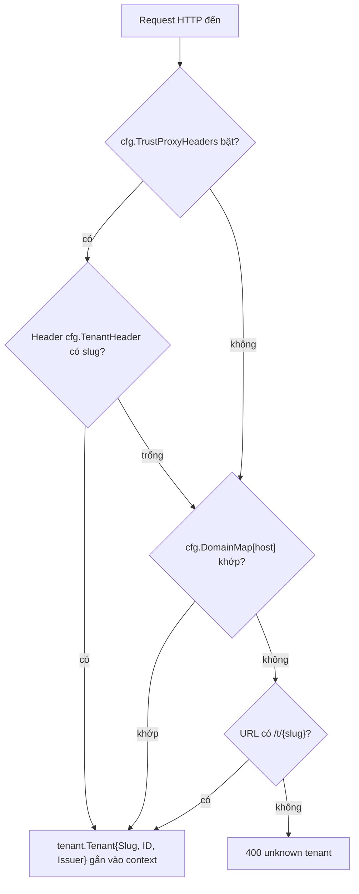

# Đa tenant bằng một cột tenant_id: được gì, mất gì?

_Tác giả **ndmt1at21**, backend engineer. Đăng ngày 11/07/2026. Phần 2 trong loạt bài **"Thiết kế một IAM service đa tenant với Go"**._

Theo telemetry Q1 2025 của Salt Labs, 95% cuộc tấn công API trong 12 tháng gần nhất xuất phát từ nguồn *đã xác thực*, và Broken Object Level Authorization (BOLA), lớp lỗi đọc được object không thuộc về mình, chiếm 27% số cuộc tấn công quan sát được ([Salt Security, "Q1 2025 State of API Security Report"](https://salt.security/press-releases/salt-labs-state-of-api-security-report-reveals-99-of-respondents-experienced-api-security-issues-in-past-12-months)). Đặt hai con số đó vào bối cảnh đa tenant, chân dung kẻ tấn công hiện ra rất rõ: không phải hacker ẩn danh ngoài tường lửa, mà là một user đăng nhập hợp lệ của tenant khác, cầm token thật, chỉ đổi đúng một cái ID trong request.

Phần 2 này trả lời câu hỏi nền móng nhất của cả loạt: nhiều tenant nằm chung một database thì cô lập nhau bằng gì? Mình đi qua ba mô hình multi-tenancy và cái giá của từng mô hình, lý do chọn cách rẻ nhất, rồi tới từng cơ chế giữ cho lựa chọn rẻ đó không biến thành một vụ rò rỉ chéo tenant. [INTERNAL-LINK: Phần 1 - bản đồ kiến trúc của cả hệ thống → tu-viet-oauth2-oidc-provider-da-tenant]

> **Tóm tắt nhanh**
>
> - Ba mô hình: shared database với một cột `tenant_id` (pool), schema-per-tenant, và database-per-tenant (silo). Cô lập càng mạnh, vận hành càng đắt.
> - Salt Labs Q1 2025: 95% tấn công API đến từ nguồn đã xác thực. Cô lập tenant phải được enforce ở từng lần truy vấn, không phải "nhớ thêm WHERE".
> - Invariant của repo: mọi bảng thuộc tenant đều mang `tenant_id`, mọi hàm repository đều nhận `tenantID` làm tham số bắt buộc.
> - Truy cập chéo tenant trả về `ErrNotFound`, không phải `ErrForbidden`: đừng xác nhận sự tồn tại của thứ không thuộc về người hỏi.
> - Tenant được resolve qua ba tầng fallback: trusted header, domain map tĩnh, rồi `/t/{slug}`; mỗi tenant có một OIDC issuer riêng.

## Ba mô hình multi-tenancy và cái giá của từng lựa chọn

Cập nhật tháng 3/2026, tài liệu tenancy patterns của Microsoft xếp các mô hình theo thang chi phí và quy mô: app riêng cho từng tenant dừng ở mức hàng trăm tenant với chi phí cao, database-per-tenant lên tới hàng trăm nghìn, còn nhiều tenant chung một database chạm mức hàng triệu tenant ở chi phí mỗi tenant thấp nhất (Microsoft Learn, "Multitenant SaaS database tenancy patterns", 2026). Cùng một phần mềm, ba cái giá rất khác nhau.

[IMAGE: Ba panel đặt cạnh nhau so sánh ba mô hình cô lập multi-tenant: một database dùng chung với các dòng dữ liệu nhiều màu, một database chia ngăn bên trong, và ba database nhỏ tách rời. | stock: none | gen: Three side-by-side isometric panels: left panel one large database cylinder containing rows striped in three colors, middle panel one cylinder divided by internal partition walls into three chambers, right panel three small separate cylinders each inside its own fence, isometric flat vector illustration, dark navy background, cyan and orange accents, clean geometric lines, no gradients, 16:9, no text, no words, no logos]

AWS đặt tên cho phổ này trong [SaaS Lens của Well-Architected Framework](https://docs.aws.amazon.com/wellarchitected/latest/saas-lens/silo-pool-and-bridge-models.html): **silo** là hạ tầng riêng cho từng tenant, "cô lập tenant mạnh nhất nhưng tốn chi phí và độ phức tạp nhất"; **pool** là dùng chung, "cô lập yếu nhất nhưng rẻ nhất"; **bridge** trộn hai kiểu theo từng microservice. Ánh xạ sang tầng database của một IAM: pool là một database, mọi bảng mang cột `tenant_id`; schema-per-tenant là mỗi tenant một schema và migration chạy N lần; silo là mỗi tenant một database, cô lập vật lý thật sự.

Giới practitioner thì cãi nhau đúng chỗ này. Bytebase (2025) khuyên thẳng: tránh schema-per-tenant, chọn hẳn shared hoặc hẳn db-per-tenant. OneUptime (2026) lại khuyên shared schema làm mặc định, chỉ "thăng cấp" khách lớn hoặc khách bị ràng buộc compliance lên schema hoặc database riêng. Vậy nghe theo ai? Theo bài toán của bạn: số tenant dự kiến, đội vận hành đang có, và yêu cầu cô lập mà khách hàng thực sự trả tiền cho.

[CHART: Bảng so sánh ba mô hình cô lập. Cột: `tenant_id` column / schema-per-tenant / database-per-tenant. Hàng: sức cô lập (app enforce / schema enforce / vật lý); chi phí mỗi tenant (thấp nhất / thấp / cao, theo AWS SaaS Lens và Microsoft Learn); trần quy mô (hàng triệu / vài nghìn schema mỗi instance / 1-100.000s, theo Microsoft); onboarding tenant mới (INSERT một dòng / CREATE SCHEMA + migrate / provision database); migration (chạy 1 lần / N lần / N lần + catalog); noisy neighbor (chung / chung instance / cách ly); restore từng tenant (khó / trung bình / dễ). Nguồn: AWS SaaS Lens; Microsoft Learn, 2026.]

> Theo AWS SaaS Lens, mô hình silo (hạ tầng riêng từng tenant) cho cô lập mạnh nhất nhưng đắt và phức tạp nhất, còn pool (dùng chung) cô lập yếu nhất nhưng rẻ nhất. Microsoft định lượng cùng phổ đó: database nhiều tenant scale tới hàng triệu tenant ở chi phí mỗi tenant thấp nhất (AWS; Microsoft Learn, 2026).

## Vì sao mình chọn shared database và một cột tenant_id?

Vì phép nhân vận hành. Trong cùng tài liệu 2026, [Microsoft có một phép tính minh họa rất đáng nhớ](https://learn.microsoft.com/en-us/azure/azure-sql/database/saas-tenancy-app-design-patterns): tách một database 1.000 tenant có 20 index thành 1.000 database đơn tenant nghĩa là bạn đang quản lý 20.000 index (Microsoft Learn, "Multitenant SaaS database tenancy patterns"). Với một IAM mà tenant mới phải lên trong vài giây, silo là câu trả lời sai ngay từ ngày đầu.

Hãy so sánh cụ thể việc onboard một tenant. Silo: provision database, chạy migration, ghi vào catalog ánh xạ tenant sang database, cấu hình backup. Schema-per-tenant: `CREATE SCHEMA` rồi chạy migration cho schema đó. Pool: `INSERT` một dòng vào bảng `tenants`. Xong. Nhớ thêm rằng service này chạy hai backend song song từ Phần 1, Postgres và MySQL, nên mọi chi phí migration đều nhân đôi: N schema nhân 2 backend là con số mình không muốn trực on-call cùng.

Công bằng mà nói, phía bên kia không hề bất khả thi. Chính Microsoft ghi nhận tooling của Azure vận hành "well over 100,000 databases" theo mô hình database-per-tenant. Nhưng đó là Azure, với một control plane chuyên dụng gồm catalog, split/merge và đội ngũ đứng sau. Mình không có, và cũng không muốn xây một control plane chỉ để phục vụ việc cô lập mà một cột có thể làm được.

[CALLOUT] 20 index thành 20.000 index: con số đáng dán lên màn hình mỗi khi database-per-tenant trông "sạch sẽ hơn". Sạch trong buổi security review, bẩn trong ca trực lúc 3 giờ sáng.

Cái giá phải trả thì AWS đã nói hộ ở trên: pool là mô hình cô lập yếu nhất. Ranh giới giữa các tenant không còn là schema hay database, mà là một điều kiện `WHERE`. Toàn bộ phần còn lại của bài là câu trả lời cho câu hỏi: làm sao mua lại sự an toàn đó bằng code, một cách có cấu trúc chứ không phải bằng trí nhớ? [INTERNAL-LINK: quản lý schema migration cho nhiều backend → bài về chiến lược migration]

> Chọn pool không phải vì nó an toàn hơn, mà vì nó là mô hình duy nhất mà một team nhỏ vận hành nổi ở quy mô nghìn tenant: onboarding là một câu INSERT, migration chạy đúng một lần cho mỗi backend. Đổi lại, sự cô lập phải được thiết kế vào tầng ứng dụng, và phải là invariant chứ không phải quy ước (Microsoft Learn, 2026).

## Làm sao chặn rò rỉ chéo tenant ngay trong chữ ký hàm?

Tính đến 2026, [OWASP API Security Top 10 bản 2023 vẫn xếp BOLA ở vị trí số 1](https://owasp.org/API-Security/editions/2023/en/0xa1-broken-object-level-authorization/), đánh giá exploitability "Easy" và mức phổ biến "Widespread", với mô tả rất đúng bệnh: server "dựa vào các tham số như object ID do client gửi lên để quyết định truy cập object nào" (OWASP, "API1:2023 Broken Object Level Authorization"). Câu trả lời của mình: đừng để việc lọc theo tenant là thứ dev phải *nhớ*; hãy làm nó thành thứ chữ ký hàm *bắt buộc*.

[IMAGE: Một chồng các dòng dữ liệu gắn tag lục giác màu đi qua một cổng lọc, chỉ dòng mang đúng tag mới được đi tiếp, minh họa invariant tenant_id. | stock: https://images.unsplash.com/photo-1518770660439-4636190af475?w=1200&h=675&fit=crop&q=80 | gen: A stack of horizontal data rows, each row stamped with a small colored hexagon tag, passing through a gate-shaped filter that only lets rows with the matching cyan hexagon continue while orange-tagged rows are deflected away, isometric flat vector illustration, dark navy background, cyan and orange accents, clean geometric lines, no gradients, 3:2, no text, no words, no logos]

Trong repo, mọi hàm repository đọc hay ghi dữ liệu thuộc tenant đều nhận `tenantID` đứng trước cả `id`:

```go
// internal/repository/mysql/user.go (bản Postgres có chữ ký y hệt)
func (r *userRepo) GetByID(ctx context.Context, tenantID, id string) (*domain.User, error)
func (r *userRepo) List(ctx context.Context, tenantID string, f domain.UserFilter) ([]*domain.User, error)
func (r *userRepo) Delete(ctx context.Context, tenantID, id string) error
```

Không có overload nào bỏ qua tham số đó, nên không tồn tại cách gọi repository mà "quên" tenant. Và helper dựng truy vấn đặt điều kiện tenant lên trước mọi điều kiện khác:

```go
// user.go: mọi truy vấn mở đầu bằng điều kiện tenant
q := `SELECT ... FROM users WHERE tenant_id = ? AND ` + cond
```

Hệ quả đáng tiền nhất nằm ở lớp bug quen thuộc: một handler cẩu thả cầm ID do user gửi lên và đưa thẳng vào `GetByID` vẫn không thể đọc chéo tenant, vì `WHERE tenant_id = ?` đã đứng đó trước khi điều kiện của handler kịp chen vào. Đây là suy luận thiết kế chứ không phải chuyện kể: invariant chặn cả lớp lỗi, không phải từng con bug. <!-- NOTE cho tác giả: plan muốn một [PERSONAL EXPERIENCE] "bug chéo tenant bị invariant chặn". Repo không có sự cố nào được ghi nhận nên bài dùng case OpenAI bên dưới (có nguồn, thuật lại). Nếu bạn có war story thật, thay đoạn này bằng chuyện của bạn. -->

Schema cũng phát biểu đúng invariant đó. Dòng đầu tiên của migration, ở cả hai backend, ghi: `-- IAM initial schema. Multi-tenant: every tenant-owned table carries tenant_id.` Ngay cả tính duy nhất cũng thuộc về tenant: `UNIQUE (tenant_id, email)` và `UNIQUE (tenant_id, username)` trên `users`, `UNIQUE (tenant_id, provider, provider_subject)` trên `user_identities`, `UNIQUE (tenant_id, name)` trên `roles`. Hai tenant khác nhau thoải mái có chung một địa chỉ email.

`[ORIGINAL DATA]` Đếm trên migration 0001-0006 của repo (2026-07-12): 17 bảng, trong đó 11 bảng mang `tenant_id NOT NULL`, 3 bảng dual-mode cho phép NULL (`permissions` và `resources` với NULL nghĩa là catalog hệ thống, `audit_log` giữ `SET NULL` để không mất lịch sử audit khi xóa tenant), và 3 bảng cố ý không có cột này: `tenants` là gốc, `role_permissions` đã scope qua role, `signing_keys` dùng chung toàn deployment.

[CHART: Donut 17 bảng trong schema IAM: 11 bảng tenant_id NOT NULL (users, user_identities, roles, user_roles, oauth_clients, identity_providers, authorization_codes, refresh_tokens, passwordless_challenges, verification_tokens, login_sessions); 3 bảng nullable dual-mode (permissions, resources, audit_log); 3 bảng không có tenant_id (tenants, role_permissions, signing_keys). Nguồn: migrations của repo, đếm 2026-07-12.]

Người phản biện giỏi nhất cho cách làm này là AWS: bài blog cổ vũ Row Level Security của họ gọi việc lọc ở tầng ứng dụng là "hy vọng câu WHERE đúng đã được viết trong mọi câu SQL" (AWS Database Blog, "Multi-tenant data isolation with PostgreSQL Row Level Security"). Đúng, nếu WHERE là quy ước thì đó là hy vọng. Nhưng ở đây nó là cấu trúc: tham số bắt buộc cộng helper duy nhất dựng truy vấn. Và còn một lý do trần trụi hơn: MySQL, backend thứ hai của service này, không có RLS. Invariant ở tầng ứng dụng là mẫu số chung của cả hai backend; RLS vẫn có thể bổ sung sau cho Postgres như một lớp phòng thủ nữa.

Còn nếu cần một lời nhắc rằng cô lập phải enforce ở *từng lần lookup*, hãy nhìn sự cố tháng 3/2023 của OpenAI: [một race condition trong thư viện redis-py](https://openai.com/index/march-20-chatgpt-outage/) khiến dữ liệu cache của user này trả về cho user khác, làm lộ thông tin thanh toán của 1,2% subscriber ChatGPT Plus hoạt động trong một cửa sổ 9 giờ, kèm tiêu đề chat của người lạ (OpenAI, "March 20 ChatGPT outage: Here's what happened"). Một cột `tenant_id` trong SQL không cứu được bạn nếu cache key không mang tenant. Invariant phải đi theo dữ liệu tới mọi tầng có state.

> Trong mô hình pool, cô lập tenant là một invariant của ứng dụng: mọi bảng thuộc tenant mang cột `tenant_id`, mọi hàm repository nhận `tenantID` như tham số bắt buộc, mọi truy vấn mở đầu bằng `WHERE tenant_id = ?`. OWASP xếp BOLA, đúng lớp lỗi mà invariant này chặn, ở vị trí số 1 rủi ro API từ 2023 đến nay (OWASP, 2023).

## Vì sao trả ErrNotFound thay vì ErrForbidden?

Trong dataset OWASP Top 10 năm 2021, Broken Access Control xuất hiện ở 94% ứng dụng được kiểm thử, với hơn 318.000 lần xuất hiện của các CWE liên quan, nhiều hơn mọi nhóm rủi ro khác (OWASP, "A01:2021 Broken Access Control"). Một phần của lớp lỗi đó không nằm ở chỗ *cho* truy cập nhầm, mà ở chỗ *tiết lộ* thứ đáng lẽ vô hình: trả 403 cho một ID chéo tenant tức là xác nhận với kẻ dò rằng ID đó tồn tại.

`[UNIQUE INSIGHT]` Quy tắc mình chốt cho service này: truy cập chéo tenant không phải lỗi phân quyền, mà là lỗi tồn tại. Với truy vấn đã scope theo tenant, một ID của tenant khác và một ID chưa từng tồn tại cho ra cùng một kết quả: không có dòng nào. Service không cần phân biệt hai trường hợp, và chính vì không phân biệt được nên không thể lỡ miệng tiết lộ. Bộ error của domain chỉ định nghĩa `ErrNotFound` và `ErrConflict`; grep toàn repo ngày 2026-07-12 không tìm thấy bất kỳ `ErrForbidden` nào cho truy cập object chéo tenant.

Với những bảng dual-mode như `permissions`, nơi truy vấn không phải lúc nào cũng scope sẵn, quy tắc được giữ bằng tay nhưng vẫn trả đúng ngữ nghĩa:

```go
// internal/service/permission.go
func (s *PermissionService) Delete(ctx context.Context, tenantID, permID string) error {
	p, err := s.repo.GetByID(ctx, permID)
	// ...
	if *p.TenantID != tenantID {
		return domain.ErrNotFound // không phải ErrForbidden
	}
	// ...
}
```

Nhưng 403 chẳng phải "thành thật" hơn sao? Đây là chỗ nên học từ người vận hành API private ở quy mô lớn nhất.

[CALLOUT] GitHub ghi thẳng trong tài liệu chính thức: ["GitHub dùng 404 Not Found thay vì 403 Forbidden để tránh xác nhận sự tồn tại của các repository private"](https://docs.github.com/en/rest/using-the-rest-api/troubleshooting-the-rest-api) (GitHub Docs, "Troubleshooting the REST API"). Anti-enumeration: đừng giúp kẻ dò ID vẽ được bản đồ dữ liệu của người khác.

Cho đầy đủ: service này vẫn dùng 403, nhưng chỉ cho chuyện *trong* tenant, khi bạn nhìn thấy resource tồn tại mà thiếu permission (middleware auth trả 403), và cho reCAPTCHA. Ranh giới rất gọn: trong tenant của bạn, sự tồn tại của resource không phải bí mật; chéo tenant, chính sự tồn tại là bí mật cần giữ.

> API đa tenant không nên trả 403 cho object của tenant khác: 403 xác nhận object tồn tại và mời gọi enumeration. Trả `ErrNotFound`/404 khiến ID ngoại tenant không thể phân biệt với ID không tồn tại, cùng lý do GitHub công khai chọn 404 cho repository private (GitHub Docs; OWASP A01:2021, lớp lỗi có mặt ở 94% ứng dụng được kiểm thử).

## Tenant được resolve từ request như thế nào?

Báo cáo State of API Security 2026 của 42Crunch gọi "missing authentication" là lỗ hổng được báo cáo nhiều nhất năm 2025, và bốn nhóm lỗi phổ biến nhất họ quan sát trùng với bốn trong năm rủi ro API hàng đầu của OWASP (42Crunch, "State of API Security 2026 Report"). Nhưng trước khi xác thực được *ai*, một service đa tenant phải trả lời câu hỏi sớm hơn: request này thuộc *thế giới nào*? Resolve sai tenant là sai user store, sai issuer, sai luôn mọi thứ phía sau.

Middleware `ResolveTenant` trả lời bằng một chuỗi fallback ba tầng, thứ tự cố định:

```go
// internal/transport/http/middleware/tenant.go (rút gọn)
func resolve(cfg config.TenantConfig, r *http.Request) (tenant.Tenant, bool) {
	if cfg.TrustProxyHeaders {
		if slug := r.Header.Get(cfg.TenantHeader); slug != "" {
			// (1) gateway phía trước đã resolve, tin header kèm tenant-ID
		}
	}
	if slug, found := cfg.DomainMap[host]; found {
		// (2) domain map tĩnh: oauth.phongvu.vn -> phongvu
	}
	if slug := chi.URLParam(r, TenantParam); slug != "" {
		// (3) path /t/{slug}; Issuer = proto + "://" + host + "/t/" + slug
	}
	return tenant.Tenant{}, false // không tầng nào khớp: 400 unknown tenant
}
```

Tầng một chỉ bật khi `cfg.TrustProxyHeaders` được cấu hình, nghĩa là service đứng sau một proxy do mình kiểm soát và proxy đó đã resolve sẵn. Tầng hai là map domain sang slug nằm trong config; doc comment của middleware nói thẳng "No database lookup happens here", binding giữa domain và tenant là chuyện cấu hình, không phải dữ liệu. Vì sao phải khắt khe vậy? Resolve chạy trên *mọi* request; một lần chạm database ở đây là thêm một điểm nghẽn và một phụ thuộc mà tầng hot path không đáng phải gánh. Tầng ba, path `/t/{slug}`, là fallback cho môi trường dev và cho tenant chưa có domain riêng; router mount cùng một bộ route hai lần, một group theo host và một group dưới `r.Route("/t/{tenantSlug}", ...)`.



Kết quả duy nhất của cả chuỗi là một giá trị `tenant.Tenant{Slug, ID, Issuer}` nằm trong context. Mọi handler phía sau đọc tenant từ đó và chỉ từ đó, không handler nào tự parse host hay header lại lần nữa. [INTERNAL-LINK: middleware chain với chi router trong Go → bài về pattern middleware]

> `ResolveTenant` là một chuỗi fallback ba tầng: trusted header từ proxy (khi được bật), rồi domain map tĩnh trong config, rồi path `/t/{slug}`; không khớp tầng nào thì request dừng ở 400. Không có lookup database nào trong chuỗi, và sản phẩm duy nhất của nó là `Tenant{Slug, ID, Issuer}` trong context, nguồn chân lý cho mọi handler phía sau.

## Mỗi tenant một OIDC issuer nghĩa là gì?

Năm 2021, các nhà nghiên cứu Wiz giành được quyền truy cập "hoàn toàn không giới hạn" vào tài khoản và database của vài nghìn khách hàng Azure, trong đó có nhiều công ty Fortune 500; Microsoft sau đó phải thông báo cho hơn 30% khách hàng Cosmos DB (Wiz Research, "ChaosDB: How we hacked thousands of Azure customers' databases"). ChaosDB là câu chuyện ranh giới tenant bị xuyên thủng ở tầng hạ tầng dùng chung. Với một IAM, ranh giới đó phải hiện diện thêm ở tầng giao thức: mỗi tenant một issuer OIDC riêng.

[IMAGE: Bốn hòn đảo lục giác lơ lửng, mỗi đảo giữ một cuộn tài liệu và một chìa khóa riêng, cùng nối xuống một khối engine dùng chung bên dưới, minh họa mỗi tenant một issuer trên cùng một service. | stock: https://images.unsplash.com/photo-1451187580459-43490279c0fa?w=1200&h=675&fit=crop&q=80 | gen: Four hexagonal islands floating at the same height, each island holding its own miniature document scroll and its own orange key on a ring, connected downward by thin lines to one shared engine block below, isometric flat vector illustration, dark navy background, cyan and orange accents, clean geometric lines, no gradients, 3:2, no text, no words, no logos]

Issuer là chuỗi định danh "ai phát hành token này", nằm trong claim `iss` của mọi token và trong discovery document. Ở đây issuer sinh ra từ chính kết quả resolve tenant: `https://oauth.phongvu.vn` cho tenant có domain riêng, hoặc `https://iam.example.com/t/phongvu` cho đường path. Hai route `/.well-known/openid-configuration` và `/.well-known/jwks.json` được mount bên trong group đã resolve tenant, và handler discovery dựng toàn bộ document từ issuer trong context:

```go
// internal/transport/http/handler/oidc.go (rút gọn)
t, ok := tenant.FromContext(r.Context())
// ...
iss := t.Issuer
doc := map[string]any{
	"issuer":                 iss,
	"authorization_endpoint": iss + "/oauth2/authorize",
	"jwks_uri":               iss + "/.well-known/jwks.json",
	// ...
}
```

Được gì? Client của tenant A cấu hình đúng issuer của A, và theo chuẩn OIDC bắt buộc verify `iss`, sẽ từ chối mọi token mang issuer của tenant B, dù hai token do cùng một service ký (OpenID Foundation, "OpenID Connect Discovery 1.0"). Ranh giới tenant đi vào tận bước verify token ở phía client. Thêm nữa, vì document tự dựng từ `t.Issuer`, không cần bảng cấu hình endpoint riêng cho từng tenant.

Một điểm cần nói thẳng: signing key hiện dùng chung toàn deployment, bảng `signing_keys` nằm trong nhóm ba bảng không mang `tenant_id`. Cô lập ở đây là cô lập issuer và discovery, chưa phải mỗi tenant một bộ key; tách key theo tenant là bước nâng cấp về sau, còn vòng đời và rotation của key là chuyện của Phần 4. [INTERNAL-LINK: JWKS và xoay signing key không rớt token → bài về vòng đời token]

> Mỗi tenant một OIDC issuer nghĩa là claim `iss`, discovery document và đường dẫn JWKS đều riêng cho từng tenant, sinh từ kết quả resolve tenant thay vì từ một bảng cấu hình. Client verify `iss` theo chuẩn OIDC sẽ tự từ chối token phát cho tenant khác, kể cả khi hai token do cùng một service ký (OpenID Foundation).

## metadata jsonb: lối thoát cho field tùy biến

Cũng theo thống kê migration ở trên (repo, 2026-07-12), 3 trong 17 bảng mang một cột metadata dạng JSON: `tenants`, `users` và `oauth_clients`, kèm `tenants.settings` mặc định `'{}'`. Đó là câu trả lời chuẩn bị sẵn cho yêu cầu chắc chắn sẽ đến: "tenant tôi cần lưu thêm field X", mà không cần bất kỳ `ALTER TABLE` nào.

Trong shared schema, `ALTER TABLE` theo yêu cầu của một tenant là bất khả: mọi tenant dùng chung bảng, thêm cột cho một khách là thêm cho tất cả. Dựng bảng EAV thì trả giá bằng độ phức tạp truy vấn. Cột JSON là điểm cân bằng: phần lõi của schema giữ nguyên kỷ luật, phần tùy biến rơi gọn vào `metadata`.

```sql
-- migrations/postgres/0001_init.up.sql (trích)
tenants.settings        jsonb NOT NULL DEFAULT '{}'
tenants.metadata        jsonb
users.metadata          jsonb NOT NULL DEFAULT '{}'  -- arbitrary user metadata
oauth_clients.metadata  jsonb
```

Bản MySQL giữ nguyên hình dạng, với dòng comment ngay đầu migration: "List fields and metadata use JSON columns for parity with Postgres." Ranh giới sử dụng cũng cần chốt ngay từ đầu: `metadata` dành cho dữ liệu *mô tả*, đừng bao giờ đặt quyết định phân quyền vào đó. Đường tùy biến có cấu trúc, nơi tenant tự định nghĩa permission lúc runtime bằng chính cột `tenant_id` nullable của bảng `permissions`, là nhân vật chính của Phần 5. [INTERNAL-LINK: đánh index cho truy vấn jsonb → bài về JSON trong database quan hệ]

## Câu hỏi thường gặp

**Cô lập bằng cột tenant_id có đủ cho compliance không?**

Tùy khung compliance và khách hàng. AWS xếp pool là mô hình cô lập yếu nhất, còn Microsoft đánh giá database-per-tenant đạt cô lập "High" với quy mô tới hàng trăm nghìn tenant (Microsoft Learn, 2026). Thiết kế hợp lý là pool làm mặc định và giữ sẵn đường thăng cấp: khách bị ràng buộc chặt thì tách riêng database cho họ.

**Sao không dùng Row Level Security của Postgres?**

Vì hai lẽ. Thứ nhất, tài liệu Postgres liệt kê các đường bypass: superuser, role có `BYPASSRLS`, và mặc định cả table owner (PostgreSQL Documentation, "Row Security Policies"). Thứ hai, service chạy 2 backend và MySQL không có RLS; invariant tầng ứng dụng là mẫu số chung, RLS có thể thêm sau cho Postgres như lớp phòng thủ thứ hai.

**Sau này chuyển một tenant sang database riêng có khó không?**

Khó ở phần catalog và routing hơn là phần dữ liệu: Microsoft mô tả mô hình hybrid "di chuyển tenant giữa các database" và tooling quản lý hơn 100.000 database của họ (Microsoft Learn, 2026). Với schema này, trích dữ liệu một tenant chỉ là dump có lọc theo `tenant_id`, vì 11 bảng nghiệp vụ đều mang cột đó.

**BOLA liên quan gì tới multi-tenancy?**

BOLA là rủi ro API số 1 theo OWASP từ 2023 và chiếm 27% cuộc tấn công trong telemetry Q1 2025 của Salt Labs. Multi-tenancy pool chính là nơi hậu quả của nó nặng nhất: một object ID đoán được cộng một câu WHERE thiếu điều kiện tenant bằng dữ liệu của khách hàng khác. Invariant `tenant_id` trong bài là thuốc đặc trị cho đúng lớp lỗi này. [INTERNAL-LINK: kiểm thử phân quyền theo tenant → bài về test isolation]

## Tiếp theo

Được gì, mất gì, giờ đã có thể trả lời gọn. Được: onboarding bằng một câu INSERT, migration chạy một lần, scale tới hàng triệu tenant theo thang của Microsoft. Mất: sự cô lập mặc định của schema hay database riêng, và phải mua lại nó bằng ba thứ: invariant `tenant_id` trong chữ ký hàm, `ErrNotFound` cho mọi truy cập chéo tenant, và issuer OIDC riêng cho từng tenant từ chuỗi resolve ba tầng.

Nền móng tenancy đã xong. Phần 3 leo lên tầng giao thức: biến endpoint `/token` thành một dispatcher với grant registry, để thêm một kiểu đăng nhập mới là thêm một file, không phải sửa một câu switch khổng lồ.

`[INTERNAL-LINK: Đọc tiếp Phần 3 - Grant registry cho endpoint /token → oauth2-grant-registry]`

---

**Nguồn tham khảo** (truy cập 2026-07-12):

- Salt Security (Salt Labs), "Q1 2025 State of API Security Report", https://salt.security/press-releases/salt-labs-state-of-api-security-report-reveals-99-of-respondents-experienced-api-security-issues-in-past-12-months
- OWASP, "API1:2023 Broken Object Level Authorization", https://owasp.org/API-Security/editions/2023/en/0xa1-broken-object-level-authorization/
- OWASP, "A01:2021 Broken Access Control", https://owasp.org/Top10/2021/A01_2021-Broken_Access_Control/
- Microsoft Learn, "Multitenant SaaS database tenancy patterns", https://learn.microsoft.com/en-us/azure/azure-sql/database/saas-tenancy-app-design-patterns
- AWS Well-Architected Framework, SaaS Lens, "Silo, Pool, and Bridge Models", https://docs.aws.amazon.com/wellarchitected/latest/saas-lens/silo-pool-and-bridge-models.html
- AWS Database Blog, "Multi-tenant data isolation with PostgreSQL Row Level Security", https://aws.amazon.com/blogs/database/multi-tenant-data-isolation-with-postgresql-row-level-security/
- Wiz Research, "ChaosDB: How we hacked thousands of Azure customers' databases", https://www.wiz.io/blog/chaosdb-how-we-hacked-thousands-of-azure-customers-databases
- OpenAI, "March 20 ChatGPT outage: Here's what happened", https://openai.com/index/march-20-chatgpt-outage/
- GitHub Docs, "Troubleshooting the REST API", https://docs.github.com/en/rest/using-the-rest-api/troubleshooting-the-rest-api
- 42Crunch, "State of API Security 2026 Report", https://42crunch.com/state-of-api-security-2026-report/
- PostgreSQL Documentation, "Row Security Policies", https://www.postgresql.org/docs/current/ddl-rowsecurity.html
- OpenID Foundation, "OpenID Connect Discovery 1.0", https://openid.net/specs/openid-connect-discovery-1_0.html
