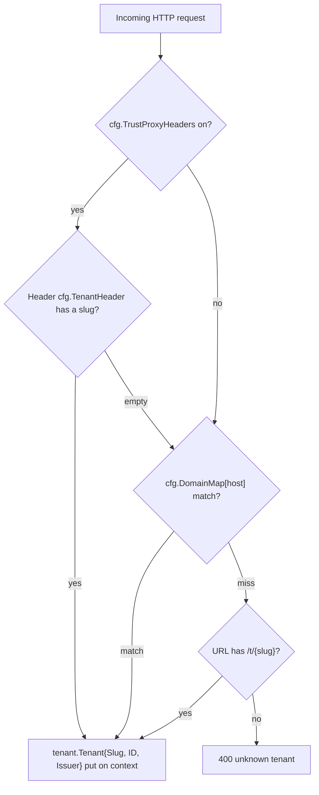

# One `tenant_id` Column: Multi-Tenancy Tradeoffs

_By **ndmt1at21**, backend engineer. Published July 11, 2026. Part 2 of the series **"Designing a Multi-Tenant IAM Service in Go."**_

In Salt Labs' Q1 2025 telemetry, 95% of API attacks over the previous 12 months came from *authenticated* sources, and Broken Object Level Authorization (BOLA), the bug class where you read an object that isn't yours, accounted for 27% of observed attacks ([Salt Security, "Q1 2025 State of API Security Report"](https://salt.security/press-releases/salt-labs-state-of-api-security-report-reveals-99-of-respondents-experienced-api-security-issues-in-past-12-months)). Read those two numbers in a multi-tenant setting and the attacker's portrait gets sharp: not an anonymous hacker outside the firewall, but a legitimately logged-in user of another tenant, holding a real token, changing exactly one ID in a request.

Part 2 answers the most foundational question of this series: when many tenants share one database, what actually keeps them apart? I'll walk through the three multi-tenancy models and what each one costs, why I picked the cheapest, and then the machinery that stops that cheap choice from turning into a cross-tenant leak. [INTERNAL-LINK: Part 1 - the architecture map of the whole system → build-multi-tenant-oauth2-provider]

> **Key takeaways**
>
> - Three models: a shared database with one `tenant_id` column (pool), schema-per-tenant, and database-per-tenant (silo). Stronger isolation, pricier operations.
> - Salt Labs Q1 2025: 95% of API attacks come from authenticated sources. Tenant isolation has to be enforced on every single lookup, not "remember the WHERE clause".
> - The repo's invariant: every tenant-owned table carries `tenant_id`, and every repository method takes `tenantID` as a required argument.
> - Cross-tenant access returns `ErrNotFound`, never `ErrForbidden`: don't confirm the existence of things that don't belong to the caller.
> - Tenants resolve through a three-stage fallback: trusted header, static domain map, then `/t/{slug}`; each tenant gets its own OIDC issuer.

## Three Multi-Tenancy Models and What Each One Costs

As of its March 2026 update, Microsoft's tenancy-patterns guide ranks the models along a cost-and-scale axis: a standalone app per tenant tops out at hundreds of tenants at high cost, database-per-tenant reaches hundreds of thousands, and many tenants sharing one database reaches millions of tenants at the lowest per-tenant cost (Microsoft Learn, "Multitenant SaaS database tenancy patterns", 2026). Same software, three very different price tags.

[IMAGE: Three side-by-side panels comparing multi-tenant isolation models: one shared database with colored rows, one database split into internal compartments, and three separate small databases. | stock: none | gen: Three side-by-side isometric panels: left panel one large database cylinder containing rows striped in three colors, middle panel one cylinder divided by internal partition walls into three chambers, right panel three small separate cylinders each inside its own fence, isometric flat vector illustration, dark navy background, cyan and orange accents, clean geometric lines, no gradients, 16:9, no text, no words, no logos]

AWS gave this spectrum its standard names in the [SaaS Lens of the Well-Architected Framework](https://docs.aws.amazon.com/wellarchitected/latest/saas-lens/silo-pool-and-bridge-models.html): **silo** means dedicated infrastructure per tenant, the "strongest tenant isolation but incurs the most cost and complexity"; **pool** means shared, the "least tenant isolation but costs the least"; **bridge** mixes the two per microservice. Mapped onto an IAM's database layer: pool is one database where every table carries a `tenant_id` column; schema-per-tenant means one schema per tenant and migrations that run N times; silo means one database per tenant, physically separate.

Practitioners argue about exactly this middle ground. Bytebase (2025) says it plainly: skip schema-per-tenant, go fully shared or fully database-per-tenant. OneUptime (2026) recommends shared schema as the default and promoting large or compliance-bound customers to their own schema or database. So whose advice wins? Your workload's: expected tenant count, the ops team you actually have, and the isolation your customers genuinely pay for.

[CHART: Comparison table of the three isolation models. Columns: `tenant_id` column / schema-per-tenant / database-per-tenant. Rows: isolation strength (app-enforced / schema-enforced / physical); per-tenant cost (lowest / low / high, per AWS SaaS Lens and Microsoft Learn); scale ceiling (millions / thousands of schemas per instance / 1-100,000s, per Microsoft); onboarding a tenant (INSERT one row / CREATE SCHEMA + migrate / provision a database); migrations (run once / run N times / run N times + catalog); noisy neighbor (shared / shared instance / isolated); per-tenant restore (hard / medium / easy). Source: AWS SaaS Lens; Microsoft Learn, 2026.]

> According to the AWS SaaS Lens, the silo model (dedicated per-tenant infrastructure) delivers the strongest tenant isolation at the highest cost and complexity, while pool (shared) delivers the least isolation at the lowest cost. Microsoft quantifies the same spectrum: a sharded multitenant database scales to millions of tenants at the lowest per-tenant cost (AWS; Microsoft Learn, 2026).

## Why Did I Pick a Shared Database With One tenant_id Column?

Because of operational multiplication. In that same 2026 guide, [Microsoft runs an arithmetic example worth memorizing](https://learn.microsoft.com/en-us/azure/azure-sql/database/saas-tenancy-app-design-patterns): split one 1,000-tenant database holding 20 indexes into 1,000 single-tenant databases and you now manage 20,000 indexes (Microsoft Learn, "Multitenant SaaS database tenancy patterns"). For an IAM where a new tenant must be live in seconds, silo is the wrong answer from day one.

Compare what onboarding one tenant looks like in each model. Silo: provision a database, run migrations, record the tenant-to-database mapping in a catalog, wire up backups. Schema-per-tenant: `CREATE SCHEMA`, then migrate that schema. Pool: `INSERT` one row into the `tenants` table. Done. Remember too that this service has run two backends since Part 1, Postgres and MySQL, so every migration cost doubles: N schemas times 2 backends is not a number I want to be on call with.

To be fair, the other side isn't impossible. Microsoft itself notes that Azure's tooling operates "well over 100,000 databases" in database-per-tenant setups. But that's Azure, with a dedicated control plane of catalogs, split/merge machinery, and a team behind it. I have none of that, and I don't want to build a control plane just to buy isolation that one column can provide.

[CALLOUT] 20 indexes becoming 20,000 indexes: the number to pin above your monitor whenever database-per-tenant starts looking "cleaner". Clean in the security review, filthy in the 3 a.m. on-call shift.

The price, AWS already named it above: pool is the weakest isolation model. The boundary between tenants stops being a schema or a database and becomes a `WHERE` clause. The rest of this post answers one question: how do you buy that safety back with code, structurally, instead of relying on memory? [INTERNAL-LINK: managing schema migrations across multiple backends → migration strategy post]

> Pool isn't the pick because it's safer; it's the pick because it's the only model a small team can operate at thousand-tenant scale: onboarding is one INSERT and migrations run exactly once per backend. In exchange, isolation must be designed into the application layer, as an invariant rather than a convention (Microsoft Learn, 2026).

## How Do You Stop Cross-Tenant Leaks in the Function Signature?

As of 2026, [the OWASP API Security Top 10, 2023 edition, still ranks BOLA at #1](https://owasp.org/API-Security/editions/2023/en/0xa1-broken-object-level-authorization/), rating its exploitability "Easy" and its prevalence "Widespread", with a diagnosis that names the disease: the server "relies more on parameters like object IDs, that are sent from the client to decide which objects to access" (OWASP, "API1:2023 Broken Object Level Authorization"). My answer: tenant filtering must never be something developers *remember*; make it something the function signature *demands*.

[IMAGE: A stack of data rows tagged with colored hexagons passing through a gate-shaped filter that only lets rows with the matching tag continue, illustrating the tenant_id invariant. | stock: https://images.unsplash.com/photo-1518770660439-4636190af475?w=1200&h=675&fit=crop&q=80 | gen: A stack of horizontal data rows, each row stamped with a small colored hexagon tag, passing through a gate-shaped filter that only lets rows with the matching cyan hexagon continue while orange-tagged rows are deflected away, isometric flat vector illustration, dark navy background, cyan and orange accents, clean geometric lines, no gradients, 3:2, no text, no words, no logos]

In the repo, every repository method that reads or writes tenant-owned data takes `tenantID` before the `id` itself:

```go
// internal/repository/mysql/user.go (the Postgres variant has identical signatures)
func (r *userRepo) GetByID(ctx context.Context, tenantID, id string) (*domain.User, error)
func (r *userRepo) List(ctx context.Context, tenantID string, f domain.UserFilter) ([]*domain.User, error)
func (r *userRepo) Delete(ctx context.Context, tenantID, id string) error
```

No overload skips that parameter, so there is no way to call the repository and "forget" the tenant. And the query helper puts the tenant condition ahead of every other condition:

```go
// user.go: every query opens with the tenant condition
q := `SELECT ... FROM users WHERE tenant_id = ? AND ` + cond
```

The most valuable consequence targets a familiar bug class: a careless handler that takes a user-supplied ID and passes it straight into `GetByID` still cannot read across tenants, because `WHERE tenant_id = ?` was there before the handler's condition ever arrived. That's design reasoning, not a war story: the invariant blocks the whole class, not individual bugs. <!-- NOTE for the author: the plan wants a [PERSONAL EXPERIENCE] item, "a cross-tenant bug caught by the invariant". No such incident is documented in the repo, so the post uses the sourced OpenAI case below instead. If you have a real war story, replace this passage with it. -->

The schema states the same invariant. The first line of the migration, on both backends, reads: `-- IAM initial schema. Multi-tenant: every tenant-owned table carries tenant_id.` Even uniqueness belongs to a tenant: `UNIQUE (tenant_id, email)` and `UNIQUE (tenant_id, username)` on `users`, `UNIQUE (tenant_id, provider, provider_subject)` on `user_identities`, `UNIQUE (tenant_id, name)` on `roles`. Two different tenants can happily share the same email address.

`[ORIGINAL DATA]` Counted across the repo's migrations 0001-0006 (2026-07-12): 17 tables, of which 11 carry `tenant_id NOT NULL`, 3 are dual-mode nullable (`permissions` and `resources`, where NULL marks a system catalog row, and `audit_log`, which uses `SET NULL` so audit history survives tenant deletion), and 3 deliberately have no such column: `tenants` is the root, `role_permissions` is already scoped through roles, and `signing_keys` is deployment-global.

[CHART: Donut of the 17 tables in the IAM schema: 11 tables with tenant_id NOT NULL (users, user_identities, roles, user_roles, oauth_clients, identity_providers, authorization_codes, refresh_tokens, passwordless_challenges, verification_tokens, login_sessions); 3 dual-mode nullable (permissions, resources, audit_log); 3 without tenant_id (tenants, role_permissions, signing_keys). Source: repo migrations, counted 2026-07-12.]

The best critic of this approach is AWS: their Row Level Security advocacy post calls application-level filtering "hoping the correct WHERE clause is implemented in every SQL statement" (AWS Database Blog, "Multi-tenant data isolation with PostgreSQL Row Level Security"). True, if the WHERE is a convention, it's hope. Here it's structure: a required parameter plus a single helper that builds the query. There's also a blunter reason: MySQL, this service's second backend, has no RLS. An application-level invariant is the common denominator of both backends; RLS can still be layered onto Postgres later as extra defense.

And if you need a reminder that isolation must be enforced on *every lookup*, look at OpenAI's incident of March 2023: [a race condition in the redis-py library](https://openai.com/index/march-20-chatgpt-outage/) served one user's cached data to another, exposing payment-related information of 1.2% of ChatGPT Plus subscribers active during a nine-hour window, along with strangers' chat titles (OpenAI, "March 20 ChatGPT outage: Here's what happened"). A `tenant_id` column in SQL won't save you if the cache key doesn't carry the tenant. The invariant has to follow the data into every stateful layer.

> In the pool model, tenant isolation is an application invariant: every tenant-owned table carries a `tenant_id` column, every repository method takes `tenantID` as a required argument, and every query opens with `WHERE tenant_id = ?`. OWASP has ranked BOLA, exactly the bug class this invariant blocks, as the #1 API risk since 2023 (OWASP, 2023).

## Why Return ErrNotFound Instead of ErrForbidden?

In OWASP's 2021 dataset, Broken Access Control appeared in 94% of tested applications, and its mapped CWEs had more than 318,000 occurrences, more than any other risk category (OWASP, "A01:2021 Broken Access Control"). Part of that bug class isn't about *granting* the wrong access; it's about *revealing* what should stay invisible: returning 403 for a cross-tenant ID confirms to the prober that the ID exists.

`[UNIQUE INSIGHT]` The rule I locked in for this service: cross-tenant access is not a permission error, it's an existence error. With tenant-scoped queries, an ID belonging to another tenant and an ID that never existed produce the same result: zero rows. The service doesn't need to tell the two cases apart, and because it can't tell them apart, it can't accidentally leak the difference. The domain error set defines only `ErrNotFound` and `ErrConflict`; a repo-wide grep on 2026-07-12 finds no `ErrForbidden` anywhere for cross-tenant object access.

For dual-mode tables like `permissions`, where the query isn't always pre-scoped, the rule is upheld by hand but the semantics stay identical:

```go
// internal/service/permission.go
func (s *PermissionService) Delete(ctx context.Context, tenantID, permID string) error {
	p, err := s.repo.GetByID(ctx, permID)
	// ...
	if *p.TenantID != tenantID {
		return domain.ErrNotFound // not ErrForbidden
	}
	// ...
}
```

But isn't 403 the more "honest" answer? This is where it pays to copy the operator of the world's largest private-repository API.

[CALLOUT] GitHub states it outright in its official docs: ["GitHub uses a 404 Not Found response instead of a 403 Forbidden response to avoid confirming the existence of private repositories"](https://docs.github.com/en/rest/using-the-rest-api/troubleshooting-the-rest-api) (GitHub Docs, "Troubleshooting the REST API"). That's anti-enumeration: don't help an ID-prober draw a map of someone else's data.

For completeness: this service still uses 403, but only for *in-tenant* matters, when you can see a resource exists but lack the permission (the auth middleware returns 403), and for reCAPTCHA. The boundary is tidy: inside your own tenant, a resource's existence is not a secret; across tenants, existence itself is the secret.

> A multi-tenant API should not return 403 for another tenant's object: 403 confirms the object exists and invites enumeration. Returning `ErrNotFound`/404 makes foreign IDs indistinguishable from nonexistent ones, the same reasoning GitHub publishes for choosing 404 on private repositories (GitHub Docs; OWASP A01:2021, a bug class present in 94% of tested applications).

## How Does a Request Resolve to Its Tenant?

42Crunch's State of API Security 2026 report calls "missing authentication" the most frequently reported vulnerability of 2025, and the four flaw classes it saw most often line up with four of OWASP's top five API risks (42Crunch, "State of API Security 2026 Report"). But before a multi-tenant service can authenticate *anyone*, it must answer an earlier question: which *world* does this request belong to? Resolve the wrong tenant and you've picked the wrong user store, the wrong issuer, the wrong everything downstream.

The `ResolveTenant` middleware answers with a three-stage fallback in a fixed order:

```go
// internal/transport/http/middleware/tenant.go (condensed)
func resolve(cfg config.TenantConfig, r *http.Request) (tenant.Tenant, bool) {
	if cfg.TrustProxyHeaders {
		if slug := r.Header.Get(cfg.TenantHeader); slug != "" {
			// (1) the gateway in front already resolved; trust header + tenant-ID
		}
	}
	if slug, found := cfg.DomainMap[host]; found {
		// (2) static domain map: oauth.phongvu.vn -> phongvu
	}
	if slug := chi.URLParam(r, TenantParam); slug != "" {
		// (3) path /t/{slug}; Issuer = proto + "://" + host + "/t/" + slug
	}
	return tenant.Tenant{}, false // nothing matched: 400 unknown tenant
}
```

Stage one only activates when `cfg.TrustProxyHeaders` is configured, meaning the service sits behind a proxy I control that has already done the resolution. Stage two is a domain-to-slug map that lives in config; the middleware's doc comment says it plainly, "No database lookup happens here": the domain-to-tenant binding is configuration, not data. Why so strict? Resolution runs on *every* request; a database hit here adds a bottleneck and a dependency the hot path shouldn't carry. Stage three, the `/t/{slug}` path, is the fallback for dev environments and for tenants without their own domain yet; the router mounts the same route set twice, one host-based group and one under `r.Route("/t/{tenantSlug}", ...)`.



The whole chain produces exactly one thing: a `tenant.Tenant{Slug, ID, Issuer}` value on the context. Every handler downstream reads the tenant from there and only from there; none of them re-parses hosts or headers on its own. [INTERNAL-LINK: middleware chains with the chi router in Go → middleware patterns post]

> `ResolveTenant` is a three-stage fallback: a trusted proxy header (when enabled), then a static domain map in config, then the `/t/{slug}` path; if nothing matches, the request stops at 400. No database lookup exists anywhere in the chain, and its only product is `Tenant{Slug, ID, Issuer}` on the context, the single source of truth for every handler behind it.

## What Does a Per-Tenant OIDC Issuer Actually Mean?

In 2021, Wiz researchers gained "complete unrestricted access" to the accounts and databases of several thousand Azure customers, Fortune 500 companies among them; Microsoft went on to notify over 30% of its Cosmos DB customers (Wiz Research, "ChaosDB: How we hacked thousands of Azure customers' databases"). ChaosDB is the story of a tenant boundary pierced at the shared-infrastructure layer. For an IAM, that boundary must also show up at the protocol layer: one OIDC issuer per tenant.

[IMAGE: Four floating hexagonal islands, each holding its own document scroll and its own key, all connected to one shared engine block below, illustrating per-tenant issuers on a single service. | stock: https://images.unsplash.com/photo-1451187580459-43490279c0fa?w=1200&h=675&fit=crop&q=80 | gen: Four hexagonal islands floating at the same height, each island holding its own miniature document scroll and its own orange key on a ring, connected downward by thin lines to one shared engine block below, isometric flat vector illustration, dark navy background, cyan and orange accents, clean geometric lines, no gradients, 3:2, no text, no words, no logos]

The issuer is the string that identifies "who issued this token"; it appears in the `iss` claim of every token and in the discovery document. Here the issuer falls straight out of tenant resolution: `https://oauth.phongvu.vn` for a tenant with its own domain, or `https://iam.example.com/t/phongvu` on the path route. The two routes `/.well-known/openid-configuration` and `/.well-known/jwks.json` are mounted inside the tenant-resolved groups, and the discovery handler builds the entire document from the issuer on the context:

```go
// internal/transport/http/handler/oidc.go (condensed)
t, ok := tenant.FromContext(r.Context())
// ...
iss := t.Issuer
doc := map[string]any{
	"issuer":                 iss,
	"authorization_endpoint": iss + "/oauth2/authorize",
	"jwks_uri":               iss + "/.well-known/jwks.json",
	// ...
}
```

What does that buy? A client of tenant A is configured with A's issuer, and since OIDC requires verifying `iss`, it will reject any token carrying tenant B's issuer, even though the same service signed both (OpenID Foundation, "OpenID Connect Discovery 1.0"). The tenant boundary reaches all the way into the client's token verification step. As a bonus, because the document derives from `t.Issuer`, there's no per-tenant endpoint-configuration table to maintain.

One thing worth saying plainly: signing keys are currently global to the deployment; `signing_keys` sits in the group of three tables without `tenant_id`. The isolation here is issuer-and-discovery isolation, not yet per-tenant key sets; splitting keys by tenant is a later upgrade, and key lifecycle and rotation belong to Part 4. [INTERNAL-LINK: JWKS and rotating signing keys without dropping tokens → token lifecycle post]

> A per-tenant OIDC issuer means the `iss` claim, the discovery document, and the JWKS path are all tenant-specific, derived from tenant resolution rather than from a configuration table. Any client that verifies `iss` per the OIDC spec automatically rejects tokens minted for another tenant, even when one service signed them both (OpenID Foundation).

## metadata jsonb: The Escape Hatch for Custom Fields

From the same migration census above (repo, 2026-07-12), 3 of the 17 tables carry a JSON `metadata` column: `tenants`, `users`, and `oauth_clients`, plus `tenants.settings` defaulting to `'{}'`. That's the pre-built answer to a request that always arrives eventually: "my tenant needs to store field X", with zero `ALTER TABLE` involved.

In a shared schema, running `ALTER TABLE` for one tenant's request is a non-starter: every tenant shares the tables, so a column added for one customer is added for all. An EAV table answers it but charges you in query complexity. A JSON column is the balance point: the schema's core stays disciplined, and customization lands neatly in `metadata`.

```sql
-- migrations/postgres/0001_init.up.sql (excerpt)
tenants.settings        jsonb NOT NULL DEFAULT '{}'
tenants.metadata        jsonb
users.metadata          jsonb NOT NULL DEFAULT '{}'  -- arbitrary user metadata
oauth_clients.metadata  jsonb
```

The MySQL variant keeps the same shape, with a comment at the top of the migration: "List fields and metadata use JSON columns for parity with Postgres." One usage boundary is worth fixing on day one: `metadata` holds *descriptive* data; never park authorization decisions in it. The structured customization path, where tenants define their own permissions at runtime through the nullable `tenant_id` on the `permissions` table, is the main character of Part 5. [INTERNAL-LINK: indexing jsonb queries → JSON in relational databases post]

## Frequently Asked Questions

**Is column-based isolation enough for compliance?**

It depends on the framework and the customer. AWS ranks pool as the weakest isolation model, while Microsoft rates database-per-tenant as "High" isolation at a scale of up to hundreds of thousands of tenants (Microsoft Learn, 2026). The sane design is pool by default with a promotion path held ready: a strictly regulated customer gets their own database.

**Why not use Postgres Row Level Security?**

Two reasons. First, the Postgres docs list the bypass routes: superusers, roles with `BYPASSRLS`, and by default table owners too (PostgreSQL Documentation, "Row Security Policies"). Second, this service runs 2 backends and MySQL has no RLS; the application-level invariant is the common denominator, and RLS can be added later on Postgres as a second layer.

**How hard is moving one tenant to its own database later?**

The hard part is the catalog and routing, not the data: Microsoft describes a hybrid model that "moves tenants between databases" and tooling managing over 100,000 databases (Microsoft Learn, 2026). With this schema, extracting one tenant's data is a filtered dump on `tenant_id`, since all 11 business tables carry the column.

**What does BOLA have to do with multi-tenancy?**

BOLA has been OWASP's #1 API risk since 2023 and made up 27% of attacks in Salt Labs' Q1 2025 telemetry. Pooled multi-tenancy is where its consequences hurt most: one guessable object ID plus one WHERE clause missing its tenant condition equals another customer's data. The `tenant_id` invariant in this post is the targeted cure for exactly that class. [INTERNAL-LINK: testing tenant-scoped authorization → isolation testing post]

## What's Next

"What do you gain, what do you lose" now has a short answer. Gained: onboarding as one INSERT, migrations that run once, and scale into the millions of tenants on Microsoft's scale ladder. Lost: the default isolation of a private schema or database, bought back with three mechanisms: the `tenant_id` invariant in every function signature, `ErrNotFound` for all cross-tenant access, and a per-tenant OIDC issuer flowing out of the three-stage resolution chain.

The tenancy foundation is done. Part 3 climbs to the protocol layer: turning the `/token` endpoint into a dispatcher backed by a grant registry, so adding a new login method means adding one file, not editing a giant switch statement.

`[INTERNAL-LINK: Read on to Part 3 - a grant registry for the /token endpoint → oauth2-grant-registry-design]`

---

**Sources** (retrieved 2026-07-12):

- Salt Security (Salt Labs), "Q1 2025 State of API Security Report", https://salt.security/press-releases/salt-labs-state-of-api-security-report-reveals-99-of-respondents-experienced-api-security-issues-in-past-12-months
- OWASP, "API1:2023 Broken Object Level Authorization", https://owasp.org/API-Security/editions/2023/en/0xa1-broken-object-level-authorization/
- OWASP, "A01:2021 Broken Access Control", https://owasp.org/Top10/2021/A01_2021-Broken_Access_Control/
- Microsoft Learn, "Multitenant SaaS database tenancy patterns", https://learn.microsoft.com/en-us/azure/azure-sql/database/saas-tenancy-app-design-patterns
- AWS Well-Architected Framework, SaaS Lens, "Silo, Pool, and Bridge Models", https://docs.aws.amazon.com/wellarchitected/latest/saas-lens/silo-pool-and-bridge-models.html
- AWS Database Blog, "Multi-tenant data isolation with PostgreSQL Row Level Security", https://aws.amazon.com/blogs/database/multi-tenant-data-isolation-with-postgresql-row-level-security/
- Wiz Research, "ChaosDB: How we hacked thousands of Azure customers' databases", https://www.wiz.io/blog/chaosdb-how-we-hacked-thousands-of-azure-customers-databases
- OpenAI, "March 20 ChatGPT outage: Here's what happened", https://openai.com/index/march-20-chatgpt-outage/
- GitHub Docs, "Troubleshooting the REST API", https://docs.github.com/en/rest/using-the-rest-api/troubleshooting-the-rest-api
- 42Crunch, "State of API Security 2026 Report", https://42crunch.com/state-of-api-security-2026-report/
- PostgreSQL Documentation, "Row Security Policies", https://www.postgresql.org/docs/current/ddl-rowsecurity.html
- OpenID Foundation, "OpenID Connect Discovery 1.0", https://openid.net/specs/openid-connect-discovery-1_0.html
