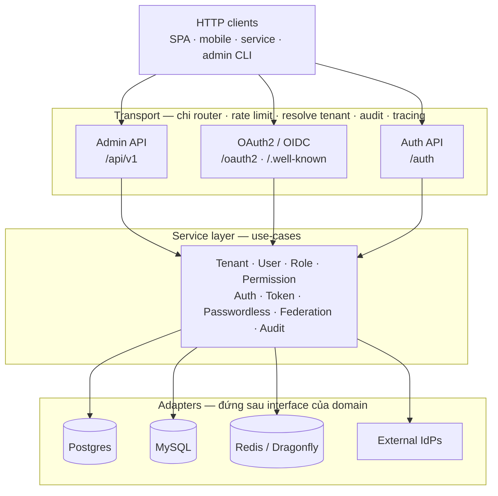
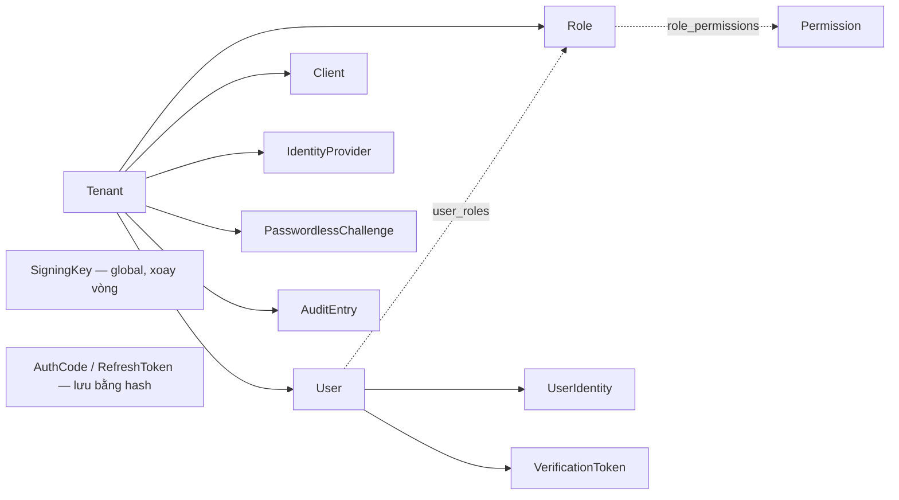

# Tự viết OAuth2/OIDC provider đa tenant: bắt đầu từ đâu?

_Tác giả **ndmt1at21**, backend engineer. Đăng ngày 11/07/2026. Phần 1 trong loạt bài **"Thiết kế một IAM service đa tenant với Go"**._

Theo báo cáo Verizon DBIR 2025, 88% các cuộc tấn công vào web application cơ bản có dính tới credential bị đánh cắp, và 60% số vụ lộ dữ liệu có yếu tố con người ([Verizon, "2025 Data Breach Investigations Report"](https://www.verizon.com/business/resources/reports/dbir/)). Cùng lúc, OWASP xếp Broken Access Control lên vị trí số 1 trong Top 10 rủi ro web năm 2021, xuất hiện ở 94% ứng dụng được kiểm thử ([OWASP Top 10:2021, A01](https://owasp.org/Top10/2021/A01_2021-Broken_Access_Control/)). Nói gọn: chỗ hệ thống hay vỡ nhất là *ai được vào* và *được làm gì*. Đó đúng là việc một IAM service phải gánh.

Loạt bài này là notes thiết kế của mình khi xây một IAM service đa tenant bằng Go: một OAuth2 authorization server kiêm OpenID Connect provider, có sẵn RBAC, federated login, passwordless, và đóng luôn vai policy decision point cho API gateway. Phần 1 chưa đụng vào code chi tiết. Nó vẽ bản đồ tổng thể và, quan trọng hơn, nói rõ *vì sao* mỗi mảnh tồn tại, để các phần sau bạn đọc thấy nhẹ. [INTERNAL-LINK: chọn database cho hệ thống nhiều tenant → bài về lựa chọn storage]

> **Tóm tắt nhanh**
>
> - IAM này gói OAuth2 + OIDC + RBAC + federation + passwordless + PDP vào một service Go stateless, chạy đa tenant trên một database dùng chung.
> - 88% tấn công web app cơ bản dính tới credential đánh cắp (Verizon DBIR 2025); Broken Access Control đứng số 1 OWASP Top 10 2021. Auth và authz là nơi đáng đầu tư nhất.
> - Kiến trúc hexagonal: domain và interface repository nằm riêng, mọi thứ SQL/cache/HTTP chỉ là adapter cắm vào. Đổi Postgres sang MySQL không đụng business logic.
> - Đa tenant bằng một cột `tenant_id` trên mọi dòng thuộc tenant, mỗi tenant một OIDC issuer riêng.
> - "Build hay buy" không có đáp án chung: bài này nói thẳng khi nào nên tự viết, khi nào nên mua.

## Vì sao IAM lại là chỗ đáng đầu tư nhất?

Vì mọi request trong hệ thống đều phải trả lời hai câu hỏi trước khi làm bất cứ việc gì: *bạn là ai* và *bạn được phép làm gì*. Câu đầu là authentication, câu sau là authorization. IAM chính là phần đứng ra trả lời cả hai. Nó là cửa trước của toàn hệ thống, và nếu cửa trước sai thì mọi lớp bảo mật phía sau gần như vô nghĩa.

Con số ở đầu bài nói thẳng điều đó: credential bị đánh cắp là đường vào phổ biến nhất, còn phân quyền hỏng là rủi ro web số 1. Cả hai đều là lỗi ở đúng tầng IAM, không phải ở firewall hay ở tầng mạng. Kẻ tấn công thường không phá tường; họ đi thẳng qua cửa bằng chìa khoá lấy được, hoặc vào đúng cửa nhưng mở được căn phòng lẽ ra không được vào.

[CALLOUT] IAM gói trong một câu: đúng người, đúng quyền, đúng lúc. "Đúng người" là authentication, "đúng quyền" là authorization, "đúng lúc" là token có hạn và thu hồi được. Cả loạt bài xoay quanh việc làm chắc ba thứ đó.

Đó là lý do IAM đáng đầu tư hơn gần như mọi thành phần khác: làm đúng một lần thì mọi service phía sau được che chắn; làm sai một lần thì cả hệ thống lộ cùng lúc. Nó là hạ tầng dùng chung, không phải tính năng riêng của một app nào. Nắm được vai trò đó rồi, phần còn lại của bài mới bắt đầu vẽ ra hình hài cụ thể.

> IAM trả lời hai câu hỏi mà mọi request đều phải hỏi: bạn là ai (authentication) và được làm gì (authorization). Nó là cửa trước của hệ thống, nơi phần lớn tấn công web đi qua bằng credential đánh cắp và nơi Broken Access Control đứng số 1 OWASP. Làm đúng một lần che chắn mọi thứ phía sau; sai một lần lộ tất cả.

## IAM này thực sự làm những gì?

Nó là sáu thứ trong một process. Là OAuth2 authorization server (phát access token, refresh token). Là OpenID Connect provider (phát id_token, có discovery và JWKS). Có RBAC kèm permission động cho từng tenant. Có federated login qua Google, Facebook và OIDC chung. Có passwordless bằng OTP và magic link. Và nó làm policy decision point để API gateway hỏi "request này cho qua không?".

Gom chúng vào một service là chủ ý, không phải lười tách. Mọi con đường đăng nhập, dù là mật khẩu, social hay OTP, cuối cùng đều quy về đúng một luồng phát token. Nhờ vậy chỉ có một chỗ ký token, một chỗ gắn permission, một chỗ để log audit. Thêm một kiểu đăng nhập mới không đẻ ra một "đường token" mới.

[IMAGE: Sơ đồ khối một cửa vào duy nhất với nhiều lối đăng nhập cùng dẫn tới một điểm phát token. | stock: none | gen: Several small doors (password, social, OTP) on the left, all funneling through one central gateway that emits a single glowing key on the right, isometric flat vector illustration, dark navy background, cyan and orange accents, clean geometric lines, no gradients, 3:2, no text, no words, no logos]

## Vì sao mình tự viết thay vì dùng Keycloak hay Auth0?

Với đa số team, câu trả lời trung thực là *đừng*. Keycloak, Auth0 hay Cognito xử lý phần lớn nhu cầu và rẻ hơn nhiều so với tự bảo trì một hệ thống bảo mật trọng yếu. Nếu team bạn không có nhu cầu gì thật đặc biệt, hãy mua và dành thời gian cho phần tạo ra tiền.

Mình tự viết vì ba nhu cầu cụ thể mà bản dựng sẵn tính phí đắt hoặc không cho bẻ theo ý: cô lập đa tenant tới tận tầng database, mỗi tenant một issuer OIDC riêng, và cho tenant tự định nghĩa permission lúc runtime. Ở đây mình chỉ kể tên, vì mỗi cái sẽ có một phần riêng mổ kỹ; đừng lo nếu bây giờ nghe còn trừu tượng.

[CHART] Bảng quyết định "build vs buy": cột trái là nhu cầu (đa tenant thật, issuer riêng mỗi tenant, permission tuỳ biến runtime, kiểm soát dữ liệu on-prem, chi phí ở quy mô lớn), cột phải đánh dấu managed IAM ✔/✘ và self-hosted ✔/✘.

> Tự viết một IAM service chỉ đáng khi bạn cần thứ mà sản phẩm dựng sẵn tính phí đắt hoặc không cho tuỳ biến: cô lập đa tenant ở tầng dữ liệu, issuer OIDC riêng cho từng tenant, và permission do tenant tự định nghĩa lúc chạy. Thiếu một trong ba, mua gần như luôn rẻ hơn tự bảo trì.

`[UNIQUE INSIGHT]` Điểm dễ bị bỏ qua: chi phí thật của "tự viết" không nằm ở lúc code xong, mà ở việc xoay signing key, vá lỗ hổng, và trực khi token phát sai. Cả loạt bài này được viết quanh đúng những chi phí đó, chứ không phải quanh cái happy path.

## Ba nhóm API chia việc thế nào?

Bề mặt HTTP được cắt thành ba nhóm theo người gọi, không phải theo entity. Nhóm **Admin** (`/api/v1/...`) để quản trị: tạo tenant, user, role, client, permission. Nhóm **OAuth2/OIDC** (`/oauth2/...` và `/.well-known/...`) là các endpoint chuẩn: authorize, token, userinfo, introspect, revoke, discovery, JWKS. Nhóm **Auth** (`/auth/...`) lo các luồng hướng người dùng cuối: register, verify email, forgot/reset password, passwordless, và federation.

Cách chia này giữ cho từng endpoint biết đúng phần việc của mình. Một request quản trị đi qua middleware phân quyền admin; một request `/oauth2/token` đi qua rate limit và grant dispatch; một callback federation đi qua kiểm tra state. Toàn bộ đứng sau một chi router chung với các middleware xuyên suốt: resolve tenant, rate limit, audit, và tracing.

Sơ đồ dưới là bản đồ mình muốn bạn nhớ suốt loạt bài: client đi vào tầng transport, transport gọi service, service chỉ nói chuyện với các interface, còn Postgres/MySQL/cache/IdP chỉ là adapter cắm phía sau.

> Bề mặt của IAM chia làm ba: Admin API để quản trị tài nguyên tenant, OAuth2/OIDC API cho các endpoint chuẩn phát và kiểm token, và Auth API cho luồng người dùng cuối như register, passwordless, federation. Cả ba gọi chung một tầng service, và tầng service chỉ nói chuyện với interface chứ không với database cụ thể.

## Domain model gồm những gì?

Đừng cố nhớ hết sơ đồ dưới đây; bạn chỉ cần nắm hình dạng chung, còn chuyện tenancy sẽ có hẳn Phần 2 đi sâu. Trung tâm là `Tenant`, và gần như mọi thứ khác treo dưới nó. Một tenant có nhiều `User`, `Role`, `Client` (đăng ký OAuth2), `IdentityProvider` (cấu hình IdP riêng), `PasswordlessChallenge` và `AuditEntry`. Mỗi user có thể có nhiều `UserIdentity` (liên kết tài khoản social) và `VerificationToken`. Role nối tới `Permission` qua bảng `role_permissions`, còn user nối tới role qua `user_roles`.

Bất biến quan trọng nhất, và mình sẽ nhắc lại ở Phần 2: mọi dòng thuộc về tenant đều mang cột `tenant_id`, và mọi hàm repository đọc/ghi dữ liệu tenant đều nhận `tenantID` làm tham số đầu tiên. Nhờ vậy, rò rỉ chéo tenant gần như không thể xảy ra ở tầng repository, vì không có truy vấn nào "quên" điều kiện tenant.

Một chi tiết nhỏ mà tinh: `Permission` có `TenantID` dạng con trỏ. `TenantID == nil` nghĩa là permission hệ thống, seed từ code. `TenantID != nil` nghĩa là permission do một tenant tự tạo lúc runtime. Cùng một bảng, hai vòng đời, phân biệt chỉ bằng việc cột đó có null hay không. Phần 5 sẽ mổ kỹ chỗ này.

## Vì sao chọn hexagonal và hai backend cùng lúc?

Vì mình muốn đổi hạ tầng mà không phải sờ vào business logic. Trong kiến trúc hexagonal, `internal/domain` chứa entity và interface repository, không phụ thuộc gì bên ngoài. Toàn bộ SQL, cache, HTTP đều là adapter nằm sau các interface đó. Hệ quả trực tiếp: Postgres và MySQL đều là "công dân hạng nhất", chọn bằng config lúc khởi động qua một storage factory, và tầng service không hề biết mình đang chạy trên cái nào.

Cách làm bị loại là nhét SQL thẳng vào service. Nó nhanh lúc đầu, nhưng mỗi lần muốn đổi driver hay viết test là phải dựng cả database. Với hexagonal, viết test cho service chỉ cần một fake repository. Cái giá phải trả là nhiều interface hơn và một chút boilerplate ở adapter, nhưng đổi lại là ranh giới rõ ràng giữa "logic" và "chỗ cắm dây".

`[ORIGINAL DATA]` Cụ thể trong repo: `internal/` gồm 13 package (domain, service, repository, storage, transport, auth, rbac, tenant, authctx, observability, platform, config, mocks), khoảng một tá domain entity, và 7 kiểu grant tách thành 7 file riêng. Con số nhỏ, nhưng ranh giới thì sạch.

> Hexagonal ở đây không phải để "cho đúng sách". Nó là công cụ để giữ hai backend SQL cùng chạy được, để test service không cần database, và để tầng logic không bao giờ phụ thuộc vào một driver cụ thể. Đó là lý do kỹ thuật, không phải sở thích kiến trúc.

## Làm sao để service stateless và scale ngang?

Bằng cách không giữ trạng thái tenant nào trong bộ nhớ process. Mọi state đều nằm ở database hoặc distributed cache: signing key ở bảng riêng, state của luồng federation và passwordless ở cache có TTL, bộ đếm rate limit cũng ở cache. Nhờ vậy, chạy bao nhiêu instance cũng được, đặt sau load balancer thoải mái, và một request có thể rơi vào bất kỳ pod nào mà không cần sticky session.

[CALLOUT] Nguyên tắc một dòng cho cả service: process không nhớ gì cả. Muốn biết token còn hạn không, hỏi database. Muốn biết state federation hợp lệ không, hỏi cache. Không có bản đồ tenant hay session nào sống trong RAM để mất khi pod restart.

Đánh đổi là mỗi thao tác thường tốn một round-trip tới database hoặc cache. Nhưng đó là cái giá xứng đáng: một hệ thống auth mà không scale ngang được thì là điểm nghẽn của mọi service khác đứng sau nó.

## Loạt bài sẽ đi qua những gì?

Phần 1 là bản đồ. Sáu phần sau đi vào từng vùng, mỗi phần mở đầu bằng câu hỏi "vì sao cần?" trước khi bàn "làm thế nào", và đều có ít nhất một sơ đồ để bạn lần theo.

1. `[INTERNAL-LINK: Phần 2 - Đa tenant bằng một cột tenant_id → multi-tenant-by-column-tenant-id]` cách cô lập tenant và ba tầng resolve tenant.
2. `[INTERNAL-LINK: Phần 3 - Grant registry → oauth2-grant-registry-design]` biến `/token` thành một dispatcher để thêm cách đăng nhập mà không sửa endpoint.
3. `[INTERNAL-LINK: Phần 4 - Refresh token rotation → refresh-token-rotation-reuse-detection]` vòng đời token, phát hiện tái sử dụng, và xoay signing key không rớt token.
4. `[INTERNAL-LINK: Phần 5 - RBAC với permission động → rbac-dynamic-tenant-permissions]` mô hình quyền và cho tenant tự định nghĩa permission lúc runtime.
5. `[INTERNAL-LINK: Phần 6 - Federation và passwordless → federated-login-passwordless-one-flow]` nhiều cách xác thực cùng quy về một luồng code.
6. `[INTERNAL-LINK: Phần 7 - IAM làm Policy Decision Point → iam-policy-decision-point-gateway]` đẩy authorization ra API gateway.
7. `[INTERNAL-LINK: Phần 8 - Secrets-at-rest, rate limit, observability → iam-security-hardening-observability]` những thứ production không ai dạy.

## Câu hỏi thường gặp

**Keycloak có làm được multi-tenant không?**
Có, qua cơ chế realm, và với nhiều team là quá đủ. Nhưng realm nghiêng về cô lập theo cấu hình hơn là cô lập tới tận từng dòng dữ liệu, và tuỳ biến permission model theo sản phẩm sẽ vướng. Nếu bạn cần permission do tenant tự định nghĩa lúc runtime, đó là lúc cân nhắc tự viết.

**Có cần OIDC nếu chỉ làm login nội bộ?**
Nếu chỉ một app tự phát và tự kiểm token thì OAuth2 thuần là đủ. Cần OIDC khi có nhiều app cùng tin một danh tính: id_token, discovery và JWKS cho phép mỗi app xác minh token độc lập mà không gọi ngược về server, đúng thứ khiến 88% tấn công web app dựa trên credential đánh cắp trở nên khó hơn.

**Postgres hay MySQL?**
Cả hai đều chạy được vì tầng repository đứng sau interface. Postgres tiện hơn ở `jsonb` cho `metadata` và một số ràng buộc partial-unique; MySQL thắng khi team bạn vận hành nó tốt sẵn. Chọn theo đội ngũ, không theo hype, và biết rằng đổi về sau không đụng business logic.

**Thêm một grant mới mất bao lâu?**
Về cấu trúc là một file: hiện thực interface `Grant` rồi đăng ký vào registry lúc khởi động. Phần 3 sẽ cho thấy chính cách tách này giúp 7 grant hiện có test được độc lập, và vì sao một dispatcher lại hơn một câu `switch` khổng lồ.

## Tiếp theo

Bạn vừa có bản đồ: sáu năng lực trong một service Go stateless, đa tenant, dựng trên kiến trúc hexagonal. Từ Phần 2, mình đi vào chỗ nền móng nhất và cũng dễ sai nhất: làm sao để một database dùng chung phục vụ nhiều tenant mà không bao giờ rò rỉ chéo, và vì sao mình chọn trả về `ErrNotFound` thay vì `ErrForbidden` khi có ai đó dò ID của tenant khác.

`[INTERNAL-LINK: Đọc tiếp Phần 2 - Đa tenant bằng một cột tenant_id → multi-tenant-by-column-tenant-id]`

_Tham khảo: [RFC 6749 - The OAuth 2.0 Authorization Framework](https://www.rfc-editor.org/rfc/rfc6749), [OpenID Connect Core 1.0](https://openid.net/specs/openid-connect-core-1_0.html), [OWASP Top 10:2021 - A01 Broken Access Control](https://owasp.org/Top10/2021/A01_2021-Broken_Access_Control/), [Verizon 2025 Data Breach Investigations Report](https://www.verizon.com/business/resources/reports/dbir/)._
