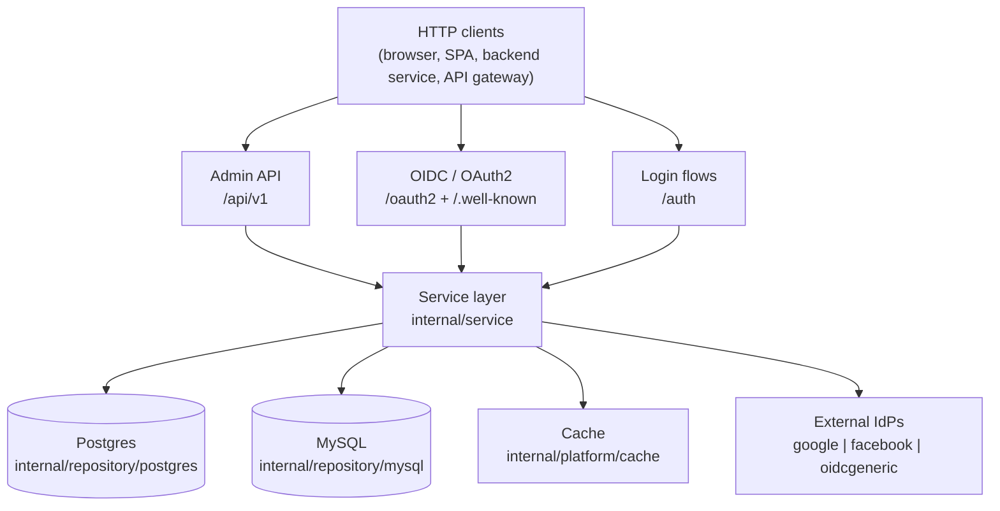

# Tự viết OAuth2/OIDC provider đa tenant: bắt đầu từ đâu?

_Tác giả **ndmt1at21**, backend engineer. Đăng ngày 11/07/2026. Phần 1 trong loạt bài **"Thiết kế một IAM service đa tenant với Go"**._

Trong DBIR 2026 (công bố tháng 5/2026), Verizon phân tích hơn 22.000 vụ breach tại 145 quốc gia và ghi nhận một cột mốc: lần đầu trong 19 năm, credential bị đánh cắp mất ngôi đường-vào-số-1 về tay khai thác lỗ hổng với 31% ([Verizon, "2026 Data Breach Investigations Report"](https://www.verizon.com/about/news/breach-industry-wide-dbir-finds)). Tin tốt cho người làm IAM? Không hẳn: cũng báo cáo đó cho thấy credential bị lạm dụng vẫn dính tới 39% tổng số vụ khi tính trên toàn chuỗi tấn công (tổng hợp của Push Security, "What the Verizon DBIR tells us about breaches in 2026"). Đường vào đổi; thứ kẻ tấn công cầm suốt chặng đường vẫn là danh tính.

Loạt bài này là notes thiết kế của mình khi tự xây một IAM service đa tenant bằng Go: một OAuth2 authorization server kiêm OpenID Connect provider, có RBAC, federated login, passwordless, và gánh luôn vai policy decision point (PDP) cho API gateway. Phần 1 chưa đi vào code từng dòng. Nó vẽ bản đồ toàn hệ thống và trả lời câu hỏi quan trọng nhất: vì sao từng mảnh tồn tại. [INTERNAL-LINK: cách chọn database cho hệ thống nhiều tenant → bài về lựa chọn storage cho SaaS]

> **Tóm tắt nhanh**
>
> - Credential dính tới 39% tổng số vụ breach trong DBIR 2026 của Verizon; IAM vẫn là cửa trước đáng gia cố nhất.
> - Một service Go stateless gói OAuth2 + OIDC + RBAC + federation + passwordless + PDP, chạy đa tenant trên database dùng chung.
> - Hexagonal: domain không biết gì về SQL; Postgres và MySQL là hai adapter cắm sau cùng một bộ interface.
> - Build hay buy không có đáp án chung: bài có bảng quyết định và số liệu chi phí 3 năm để bạn tự cân.

## Vì sao IAM là chỗ đáng đầu tư nhất?

Vì danh tính chạy xuyên suốt gần như mọi cuộc tấn công: credential bị lạm dụng có mặt trong 39% tổng số vụ breach theo DBIR 2026 (Verizon, tổng hợp bởi SpyCloud, "Top Takeaways from the 2026 Verizon DBIR"). Mọi request đều phải trả lời hai câu hỏi trước khi làm bất cứ việc gì: bạn là ai, và bạn được làm gì. IAM đứng ra trả lời cả hai.

Thoạt nhìn, DBIR 2026 như đang nói ngược lại: khai thác lỗ hổng giờ mở màn 31% số vụ. Nhưng SpyCloud đọc dữ liệu rất thẳng: exploit chỉ là đường vào, còn credential đánh cắp mới giúp kẻ tấn công di chuyển ngang, leo thang đặc quyền và kiếm tiền từ quyền truy cập. Exploit mở cửa; danh tính đưa họ đi nốt quãng còn lại.

Chi phí cũng đứng về phía việc phòng thủ sớm. Theo IBM, "Cost of a Data Breach Report 2025", breach khởi đầu bằng credential bị đánh cắp tốn trung bình 4,67 triệu USD và mất 246 ngày để phát hiện và khống chế, chậm nhất trong mọi vector. Tám tháng có người đăng nhập "hợp lệ" bằng chìa khoá ăn trộm. Firewall nào bắt được chuyện đó?

Nửa còn lại, authorization, cũng chẳng sáng hơn: [OWASP Top 10:2025](https://owasp.org/Top10/2025/A01_2025-Broken_Access_Control/) giữ Broken Access Control ở ghế số 1, với 100% ứng dụng được kiểm thử dính ít nhất một dạng lỗi phân quyền và 1.839.701 lần xuất hiện trong dữ liệu đóng góp, cao nhất mọi hạng mục. Đây chính là bài toán RBAC và PDP của Phần 5 và Phần 7.

[CHART: Lollipop ngang "Credential trong DBIR 2026, mỗi giai đoạn một con số": credential abuse xuất hiện trong 39% tổng số vụ breach · 31% số vụ mở màn bằng khai thác lỗ hổng · ~16% số vụ mở màn bằng credential abuse · 50% nạn nhân ransomware có sự cố credential/infostealer trong 95 ngày trước đó | Nguồn: Verizon DBIR 2026 (Verizon newsroom; Push Security; SpyCloud)]

> Theo DBIR 2026 của Verizon (5/2026), credential bị lạm dụng xuất hiện trong 39% tổng số vụ breach dù chỉ khoảng 16% số vụ dùng nó làm đường vào đầu tiên. IBM Cost of a Data Breach 2025 đo được breach gốc credential tốn trung bình 4,67 triệu USD và cần 246 ngày để phát hiện và khống chế, lâu nhất trong mọi vector tấn công.

## IAM này thực sự làm những gì?

Sáu vai trong một process Go: OAuth2 authorization server, OIDC provider, RBAC, federated login, passwordless, và policy decision point. Không phải slide marketing: riêng hai nhóm route `/oauth2` và `/auth` trong router của repo đã có 16 endpoint public (`router.go`, mình đọc ngày 2026-07-12), chưa tính nhóm Admin API.

```text
/.well-known/openid-configuration     /.well-known/jwks.json
GET  /oauth2/authorize                POST /oauth2/token
/oauth2/userinfo                      /oauth2/introspect
/oauth2/revoke                        /oauth2/logout
POST /authz/decision
/auth/passwordless/start
/auth/login/{provider}                /auth/callback/{provider}
/auth/register                        /auth/verify-email
/auth/forgot-password                 /auth/reset-password
```

Nửa trên là thuần chuẩn: `authorize` và `token` theo [RFC 6749](https://datatracker.ietf.org/doc/html/rfc6749), cộng id_token, discovery và userinfo theo [OpenID Connect Core 1.0](https://openid.net/specs/openid-connect-core-1_0.html). Một route đứng lệch hàng: `POST /authz/decision`, chính là PDP mà API gateway gọi trên từng request. Nửa dưới là phần dành cho con người: đăng ký, xác thực email, quên mật khẩu, OTP, social login.

Vì sao nhét chung một chỗ? Bởi mọi con đường đăng nhập, dù là password, social hay OTP, cuối cùng đều quy về đúng một luồng phát token. Một chỗ ký token, một chỗ gắn permission, một chỗ ghi audit. Thêm một kiểu đăng nhập mới không đẻ ra một đường token thứ hai.

[IMAGE: Một toà nhà cách điệu có ba cửa vào riêng biệt cùng dẫn về một sảnh chung, minh hoạ ba API surface của cùng một service. | stock: none | gen: An isometric building cut open to show one shared interior, with three separate doorways on different faces, one door with a gear icon, one with a shield icon, one with a person icon, paths from each door merging into a single core room, isometric flat vector illustration, dark navy background, cyan and orange accents, clean geometric lines, no gradients, 16:9, no text, no words, no logos]

> Service này expose 16 endpoint public trên hai nhóm route `/oauth2` và `/auth` (`router.go`, đọc 2026-07-12), phủ trọn bề mặt OAuth2 và OIDC: authorize, token, userinfo, introspect, revoke, logout, discovery và JWKS, cộng các luồng passwordless và federation cùng đổ về một đường phát token duy nhất.

## Vì sao tự viết thay vì dùng Keycloak hay Auth0?

Câu trả lời thật lòng cho đa số team là: đừng tự viết. Trong phân tích tháng 5/2026, [Duende Software](https://duendesoftware.com/blog/20260507-the-real-cost-of-build-vs-buy), "The Real Cost of Build vs. Buy for Identity", ước tính một identity stack tự xây tốn khoảng 1,1 triệu USD trong 3 năm, so với chừng 210 nghìn USD khi dùng framework có sẵn. Mình vẫn tự viết, vì ba nhu cầu cụ thể mà mua không giải được.

Đọc con số đó cho đúng đã: Duende bán IdentityServer, nên đây là mô hình của vendor có lợi ích, không phải khảo sát trung lập. Được cái giả định công khai: kỹ sư 180 nghìn USD/năm tính đủ chi phí, 3 người xây 6 tháng, 0,5-1 FTE bảo trì, SOC 2 50-200 nghìn USD/năm. Cắt đôi mô hình đi nữa, tự viết vẫn là một khoản đầu tư thật, không phải side project.

Phía open source cũng đang mạnh lên. Release notes chính thức của [Keycloak 26](https://www.keycloak.org/2024/10/keycloak-2600-released) (10/2024) viết: "Starting with Keycloak 26, the Organizations feature is fully supported", tức multi-tenant hạng nhất ngay trong một realm. Vậy còn thiếu gì? Ba thứ, với mình: organizations vẫn dùng chung một realm và một issuer; permission do tenant tự định nghĩa lúc runtime không nằm trong mô hình của nó; và mình muốn nhúng IAM vào hạ tầng Go sẵn có với dual Postgres/MySQL, không vận hành thêm một cụm JVM.

<!-- [UNIQUE INSIGHT] -->
Bảng dưới là phân tích của riêng mình, ghép từ release notes của Keycloak, mô hình chi phí của Duende và chính repo này:

| Nhu cầu | Keycloak (Organizations, v26+) | Auth0 / managed | Tự viết |
|---|---|---|---|
| Mỗi tenant một OIDC issuer + JWKS riêng | Không: organizations chung realm, chung issuer | Một phần: có org theo tenant, nhưng vendor host, không phải của bạn | Có: issuer theo tenant nằm sẵn trong thiết kế |
| Tenant tự định nghĩa permission lúc runtime, nằm trong token | Hạn chế: role tĩnh theo realm/client | Hạn chế: RBAC có sẵn, custom claim qua action | Có: permission là dữ liệu (Phần 5) |
| Nhúng vào hạ tầng sẵn có (Go, dual Postgres/MySQL, không thêm JVM) | Không: kéo theo footprint JVM riêng | Không: chạy ngoài hạ tầng của bạn, tính phí theo MAU | Có: một binary Go, storage tự chọn |
| Cái giá phải trả | Vận hành một cụm Keycloak | Phí theo MAU + phụ thuộc vendor | Tự gánh chuẩn bảo mật + 0,5-1 FTE bảo trì (mô hình Duende) |

[CHART: Grouped bar "Chi phí 3 năm: tự xây vs mua framework (mô hình vendor của Duende, giả định ghi trong caption)": DIY năm 1 435K USD (build 270K + bảo trì 90K + compliance 75K), năm 2 280K, năm 3 300K, tổng ~1,0-1,1 triệu USD · Framework năm 1 80K (license 50K + tích hợp 30K), năm 2 65K, năm 3 65K, tổng ~210K USD | Nguồn: Duende Software, "The Real Cost of Build vs. Buy for Identity", 2026-05-07]

> Mô hình build-vs-buy của Duende (5/2026) đặt chi phí tự xây identity stack ở mức khoảng 1,1 triệu USD cho 3 năm, so với 210 nghìn USD nếu mua framework, dựa trên giả định 3 kỹ sư xây 6 tháng và 0,5-1 FTE bảo trì. Là hãng bán IdentityServer, Duende hưởng lợi từ kết luận này, nhưng giả định của họ công khai và kiểm được.

## Ba cánh cửa vào một service: Admin, OIDC/OAuth2, Auth

Toàn bộ HTTP surface chia làm 3 nhóm route, và router mount chúng theo hai cách: theo host với middleware `resolveTenant` đọc domain của request, và fallback theo path `/t/{tenant}` (`router.go`, đọc 2026-07-12). Mỗi cửa phục vụ một loại khách khác nhau, với middleware khác nhau.



Nhóm một, `mountAdminRoutes`, treo dưới `/api/v1`: CRUD cho tenant, user, role, client, identity provider, permission và resource. Đây là cửa cho admin console và automation. Nhóm hai là `/oauth2` cộng `/.well-known`: cửa chuẩn mà mọi thư viện OIDC client hiểu sẵn. Nhóm ba, `/auth`, chứa các luồng đăng nhập cho con người: register, passwordless, social callback.

Chi tiết đáng để ý: `mountOIDCRoutes` được mount hai lần. Một lần theo host, tenant được resolve từ domain của request. Một lần dưới `/t/{slug}`, làm fallback cho tenant chưa trỏ domain riêng. Cùng một bộ handler, hai cách định vị tenant; Phần 2 sẽ mổ chuỗi resolve này.

## Domain model: cả hệ thống gói trong 15 entity

`internal/domain` là tầng nhỏ nhất trong repo: 733 dòng Go non-test (số mình đếm ngày 2026-07-12), nhưng khai báo đủ 15 entity mà mọi tầng khác xoay quanh, với `Tenant` đứng ở gốc của mọi quan hệ sở hữu.

[IMAGE: Cận cảnh một bức tường ô lục giác xám có đèn hắt phía sau, các ô giống hệt nhau nhưng tách bạch rõ ràng, như các tenant trong một hệ thống. | stock: https://images.unsplash.com/photo-1582135739786-3bceafcaea85?w=1200&h=800&fit=crop&q=80 | gen: One large hexagon in the foreground containing small connected icons of a person, a shield, and a key linked by thin lines, with two dimmer hexagons behind it repeating the same internal structure, isometric flat vector illustration, dark navy background, cyan and orange accents, clean geometric lines, no gradients, 3:2, no text, no words, no logos]

```go
// internal/domain/tenant.go
type Tenant struct {
    ID       string
    Slug     string
    Name     string
    Status   TenantStatus
    Settings TenantSettings // config access/refresh token riêng theo tenant
    Metadata Metadata
    // ...
}
```

Quanh gốc đó là bốn cụm: danh tính (`User`, `UserIdentity`, `VerificationToken`), phân quyền (`Role`, `Permission`, `Resource`), bộ máy OAuth2 (`Client`, `AuthCode`, `RefreshToken`, `SigningKey`), và luồng đăng nhập (`IdentityProvider`, `PasswordlessChallenge`, `LoginSession`), cộng `AuditEntry` để ghi vết. `User` mang thẳng `TenantID` làm khoá sở hữu; không tồn tại user "toàn cục" nào cả.

Thứ vắng mặt còn nói nhiều hơn thứ có mặt: không import pgx, không tag SQL, không kiểu HTTP nào. Domain chỉ là struct và interface thuần Go. Vì sao điều đó quan trọng? Mục kế tiếp là câu trả lời.

## Hexagonal và hai backend SQL: vì sao chịu gấp đôi việc?

<!-- [ORIGINAL DATA] -->
Repo hiện có 22.082 dòng Go trong 173 file, 37 package; bỏ test còn 16.469 dòng (mình đếm bằng `wc -l` và `go list`, 2026-07-12). Tầng dày nhất sau transport là repository với 2.963 dòng, vì nó cài cùng một bộ interface hai lần: Postgres trên pgx và MySQL trên `database/sql`.

> ARCHITECTURE.md của repo đặt luật chơi: "domain entities and repository interfaces live in `internal/domain` with no external dependencies. All infrastructure (SQL, cache, HTTP) is an adapter behind those interfaces." Service gọi interface; adapter nào đứng sau chỉ là chuyện config, và chính điều đó làm dual backend khả thi.

Một port trông thế này; để ý `tenantID` đứng đầu chữ ký:

```go
// internal/domain/repository.go
type UserRepository interface {
    Create(ctx context.Context, u *User) error
    GetByID(ctx context.Context, tenantID, id string) (*User, error)
    // ...
}
```

Thứ tự tham số đó không phải để đẹp. Nó là invariant chống rò rỉ chéo tenant, và Phần 2 xây quanh đúng nó. Factory chọn backend lúc khởi động:

```go
// internal/storage/storage.go
func Open(ctx context.Context, cfg config.DBConfig) (*Repositories, error) {
    switch cfg.Driver {
    case config.DriverPostgres:
        // pgx pool -> postgres.New(pool)
    case config.DriverMySQL:
        // database/sql -> mysql.New(conn)
    }
    // đường nào cũng trả về cùng một bundle 15 repository
}
```

Nuôi hai backend nghe như gấp đôi việc, và ở tầng adapter thì đúng thế thật. Đổi lại, bộ interface buộc phải trung thực: chỉ một câu SQL đặc thù Postgres lọt lên service layer là adapter MySQL gãy ngay lúc build. Phương án bị loại là trộn SQL thẳng vào service: nhanh ở ngày đầu, nhưng hàn chết bạn vào một database và biến mọi cuộc migration thành ca phẫu thuật.

[CHART: Donut "16,5 nghìn dòng Go non-test nằm ở đâu": transport 3.396 · service 3.102 · repository 2.963 · auth 2.373 · platform 893 · domain 733 · internal khác 729 · cmd/migrations/sdk ~2.280 | Nguồn: dữ liệu tự đếm từ repo iam, 2026-07-12]

## Stateless service thì scale ngang kiểu gì?

Con số đáng nhớ nhất ở đây là 0: theo ARCHITECTURE.md của repo (đọc 2026-07-12), process không giữ tenant state nào trong RAM; mọi thứ sống trong database hoặc cache phân tán. Cần thêm công suất? Thêm replica. Toàn bộ quy trình chỉ có vậy.

[IMAGE: Một dãy rack server sáng đèn trạng thái trong phòng data center thiếu sáng, gợi hình việc thêm bớt node tuỳ tải. | stock: https://images.unsplash.com/photo-1680992046626-418f7e910589?w=1280&h=720&fit=crop&q=80 | gen: A row of four identical server nodes drawn as simple boxes, arrows from all four converging down onto one shared database cylinder and one cache slab beneath them, one node faded out mid-removal to suggest elasticity, isometric flat vector illustration, dark navy background, cyan and orange accents, clean geometric lines, no gradients, 16:9, no text, no words, no logos]

State của federated login là ví dụ dễ thấy nhất. Tham số `state` của một phiên social login đang bay nằm trong cache dưới một key có namespace, kèm TTL, nên callback từ Google rơi vào replica nào cũng xử lý được:

```go
// internal/transport/http/handler/federation.go
func flowStateKey(state string) string { return "fed:state:" + state }
// ...
h.cache.Set(ctx, flowStateKey(state), b, flowStateTTL)
```

Rate limit cũng theo đúng luật đó: `middleware.NewRateLimiter(d.Cache, d.Logger)` đếm trên cache dùng chung, nên giới hạn giữ nguyên xuyên các node thay vì reset theo từng pod.

Stateless có giá của nó. Cache thôi không còn là tối ưu mà thành một phần của tính đúng đắn: mất cache là các luồng login đang bay chết theo. Đổi lại là những lần deploy không drama: kill một pod, không ai bị logout, vì chẳng có session nào từng sống trong pod. Trade-off này dễ chọn.

> "The process holds no in-memory tenant state. All state lives in the DB or the distributed cache. Horizontal scaling is safe" (ARCHITECTURE.md, repo iam, đọc 2026-07-12). Với một IAM service, điều này nghĩa là state của login flow, bộ đếm rate limit và challenge tạm thời đều nằm trong cache dùng chung, không bao giờ nằm trong biến cục bộ.

## Lộ trình series: 7 mảnh còn lại của bản đồ

Mỗi phần sau đào một vùng của sơ đồ phía trên, và vùng nào cũng có code thật đứng sau chứ không phải pseudocode. Một ví dụ ngay: `/token` không phải một khối switch khổng lồ; nó dispatch qua một registry đăng ký đúng 7 grant (`buildGrantRegistry`, `router.go`, đọc 2026-07-12).

```go
// internal/auth/grant/grant.go
type Grant interface {
    Type() string
    Handle(ctx context.Context, req *Request) (*TokenResponse, error)
}

type Registry struct {
    grants map[string]Grant
}
```

Đường đi của series từ đây:

- [INTERNAL-LINK: Phần 2: đa tenant bằng một cột tenant_id, được gì mất gì → da-tenant-bang-cot-tenant-id]. Invariant chống rò rỉ chéo tenant, chuỗi resolve tenant, mỗi tenant một issuer.
- [INTERNAL-LINK: Phần 3: grant registry cho endpoint /token → oauth2-grant-registry]. Interface `Grant` ở trên, PKCE, thêm kiểu đăng nhập không đụng code cũ.
- [INTERNAL-LINK: Phần 4: refresh token rotation và chain revocation → refresh-token-rotation-chain-revocation]. Token lưu bằng SHA-256 hash, phát hiện reuse, xoay signing key không downtime.
- [INTERNAL-LINK: Phần 5: RBAC với permission tenant tự định nghĩa → rbac-permission-dong-da-tenant]. Wildcard `resource:action` và đường permission vào JWT.
- [INTERNAL-LINK: Phần 6: federated login và passwordless chung một luồng → federated-login-passwordless-mot-luong]. Một adapter mỗi IdP; mọi thứ quy về một authorization code.
- [INTERNAL-LINK: Phần 7: IAM làm policy decision point cho API gateway → iam-policy-decision-point-api-gateway]. Contract `/authz/decision` và plugin Kong.
- [INTERNAL-LINK: Phần 8: secrets-at-rest, rate limit, observability → iam-security-hardening-observability]. Những mối lo production không ai dạy.

[CALLOUT] Đọc lệch thứ tự được không? Được, mỗi phần tự đứng. Chỉ có hai phụ thuộc mềm: Phần 2 là móng của Phần 5, và Phần 3 nên đi trước Phần 4, vì grant là nơi token sinh ra.

## Câu hỏi thường gặp

### Keycloak có làm được multi-tenant không?

Có, ở mức đủ dùng cho nhiều team: từ Keycloak 26 (10/2024), tính năng Organizations được hỗ trợ đầy đủ theo release notes chính thức. Điểm cần cân: organizations sống chung một realm, nghĩa là chung issuer và chung JWKS. Cần issuer riêng theo tenant hoặc permission động thì quay về realm-per-tenant, hoặc tự viết.

### Có cần OIDC nếu chỉ làm login nội bộ?

Nên, vì bạn thừa hưởng những flow đã bị tấn công và vá suốt hơn một thập kỷ thay vì tự chế session. RFC 9700 (1/2025) còn chuẩn hoá luôn các MUST, như PKCE cho public client. Nhớ rằng breach gốc credential mất 246 ngày mới bị phát hiện (IBM, 2025): đây không phải chỗ để sáng tạo.

### Postgres hay MySQL?

Cả hai đều first-class trong thiết kế này: 15 repository cài cùng bộ interface domain, mỗi backend có bộ migration riêng, và `storage.Open` chọn driver theo `config.DBConfig.Driver`. Câu hỏi thật sự là team bạn đang vận hành thứ gì thành thạo; service không nghiêng về bên nào.

### Tự viết thì tốn bao nhiêu công bảo trì?

Mô hình của Duende (5/2026) tính 0,5-1 FTE bảo trì liên tục, cộng 50-200 nghìn USD mỗi năm nếu cần SOC 2. Repo đứng sau loạt bài này nặng 22.082 dòng Go khi đã có sẵn hexagonal và dual backend. Con số không nhỏ; hãy đặt nó lên bàn cân với ba nhu cầu ở phần build-vs-buy.

## Bản đồ trước, chi tiết sau

Bốn gạch đầu dòng gói được cả kiến trúc: một service Go stateless; ba cửa API cho ba loại khách; domain hexagonal với hai backend SQL sau cùng một bộ interface; và mọi đường đăng nhập hội tụ về một luồng phát token. Mỗi quyết định đều kèm phương án bị loại và lý do, còn credential dính 39% số vụ breach (DBIR 2026) là lý do lớn nhất để làm cẩn thận. Bước hợp lý tiếp theo là cái móng dưới tất cả: cột `tenant_id` và invariant chặn rò rỉ chéo tenant. [INTERNAL-LINK: đọc tiếp Phần 2: đa tenant bằng một cột tenant_id → da-tenant-bang-cot-tenant-id]

## Nguồn tham khảo

- Verizon, "2026 Data Breach Investigations Report" (newsroom), retrieved 2026-07-12, https://www.verizon.com/about/news/breach-industry-wide-dbir-finds
- Push Security, "What the Verizon DBIR tells us about breaches in 2026", retrieved 2026-07-12, https://pushsecurity.com/blog/verizon-dbir-2026-review
- SpyCloud, "Top Takeaways from the 2026 Verizon DBIR", retrieved 2026-07-12, https://spycloud.com/blog/top-takeaways-from-the-2026-verizon-data-breach-investigations-report/
- OWASP, "A01:2025 Broken Access Control (OWASP Top 10:2025)", retrieved 2026-07-12, https://owasp.org/Top10/2025/A01_2025-Broken_Access_Control/
- IBM, "Cost of a Data Breach Report 2025", retrieved 2026-07-12 (số liệu đối chiếu qua SpyCloud và Enzoic do trang gốc chặn truy cập tự động), https://www.ibm.com/reports/data-breach
- Enzoic, "IBM Cost of a Data Breach Report 2025", retrieved 2026-07-12, https://www.enzoic.com/blog/ibm-cost-of-a-data-breach-report-2025/
- Duende Software, "The Real Cost of Build vs. Buy for Identity", retrieved 2026-07-12, https://duendesoftware.com/blog/20260507-the-real-cost-of-build-vs-buy
- Keycloak, "Keycloak 26.0.0 released", retrieved 2026-07-12, https://www.keycloak.org/2024/10/keycloak-2600-released
- IETF, "RFC 6749: The OAuth 2.0 Authorization Framework", retrieved 2026-07-12, https://datatracker.ietf.org/doc/html/rfc6749
- IETF, "RFC 9700: Best Current Practice for OAuth 2.0 Security", retrieved 2026-07-12, https://datatracker.ietf.org/doc/html/rfc9700
- OpenID Foundation, "OpenID Connect Core 1.0", retrieved 2026-07-12, https://openid.net/specs/openid-connect-core-1_0.html
- ndmt1at21, repository "iam" (dữ liệu tự đo: LOC, package, route, đếm 2026-07-12), https://github.com/ndmt1at21/iam
